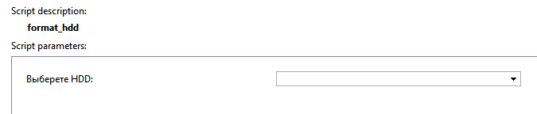

## Основные функции

Форматирование архивных HDD на серверах Trassir.

## Установка

* Перейти в автоматизацию, нажать «Загрузить пример» и выбрать «Из файла», указав путь к скрипту.
* Снять галочку «Включить скрипт» и нажать сохранить.
* Выберать диск для форматирования.
* Нажать "Сохранить и запустить".

## Настройки скрипта

На HDD удалится файл .format_mark и он будет доступен на удаление в архиве.

**ВНИМАНИЕ! Процесс не обратимый.**