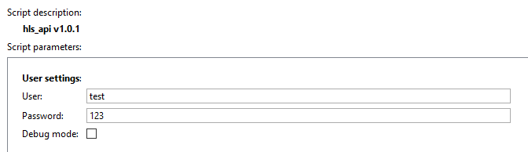

## Основные функции
Скрипт позволяет автоматизировать получение ссылки на видеопоток в формате HLS.

## Установка
* Перейти в автоматизацию, нажать «Загрузить пример» и выбрать «Из файла», указав путь к скрипту.
* Снять галочку «Включить скрипт» и нажать сохранить.
* Выполнить настройку и нажать "Сохранить и запустить".

## Настройка скрипта


**User -** имя пользователя под которым будет запрашиваться sid

**Password -** пароль пользователя

**Debug mode -** режим отладки


**Формат запроса к API**:

```
https://server_ip:sdk_port/s/hls_api/get_video?channel=channel_guid&stream=main
```

- **server_ip** **-** IP адрес сервера 
- **sdk_port -** порт SDK
- **channel -** guid канала
- **stream -** тип запрашиваемого потока

Параметры **channel** и **stream** - обязательные для данного метода, дополнительный параметр:

- **hw** - логический параметр включающий запрос архива с устройства:
  - **true** - в потоке архив с устройства;
  - **false** - в потоке архив TRASSIR.

Общая информация о получении видеопотока через SDK - https://www.dssl.ru/files/trassir/manual/ru/sdk-examples-video.html

**Ответ API в JSON формате:**

```
{
    "token": "EHrWQ7UW",
    "hls": "https://192.168.0.10:8080/hls/EHrWQ7UW/master.m3u8",
    "sid": "YLsPdG24"
}
```

Полученные sid и token возможно в дальнейшем использовать для работы с архивом - https://www.dssl.ru/files/trassir/manual/ru/sdk-examples-archive.html