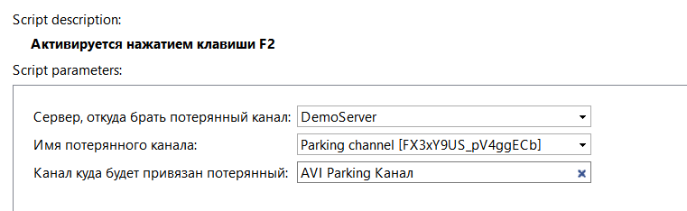

## Основные функции

Скрипт для привязки потерянных каналов, в случае переподключения камер как новые IP-устройства, или в случае не удачного восстановления бэкапа.

:x:При удалённом подключении к серверу скрипт нужно запустить на **клиенте**

:x:Не используйте данный скрипт для восстановления потерянных каналов в результате перевода (сбоя) времени на сервере. 

## Установка

* Перейти в автоматизацию, нажать «Загрузить пример» и выбрать «Из файла», указав путь к скрипту.
* Снять галочку «Включить скрипт» и нажать сохранить.
* Выполнить настройку и нажать "Сохранить и запустить"

## Настройки скрипта

**В параметрах скрипта необходимо:**

* Выбрать в параметрах сервер, на котором хотите восстановить каналы.
* Сохранить и запустить скрипт
* При выполнении 2-й параметр заполнится потерянными каналами.
* Выбрать в параметрах текущий канал камеры и сохранить скрипт.
* Указать потерянный канал и сохранить скрипт.
* Нажать на **F2**
* Скрипт заменил каналы местами. Для обновления списка перейдите в любую строчку настроек(список слева) и вернитесь обратно к скрипту.

Обращаем ваше внимание на то, что полностью "срастить" архивы обоих каналов нет возможности, т.к. архивные данные уже записаны на диск с разными ID. 
Текущий канал может быть ассоциирован только с одним ID архива. 
Поэтому данная операция присвоит выбранный архив потерянного канала текущему рабочему каналу, а архив записанный за время работы нового канала перейдет в потерянные.

