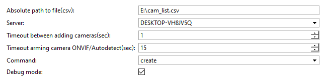
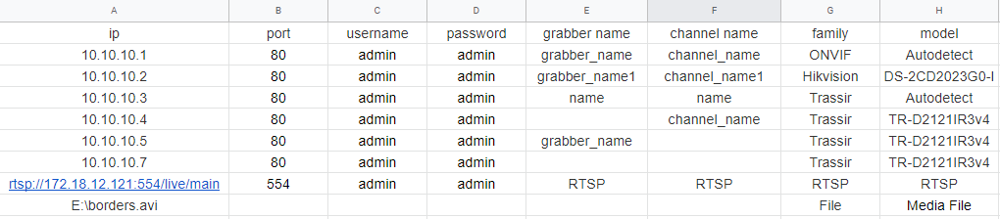
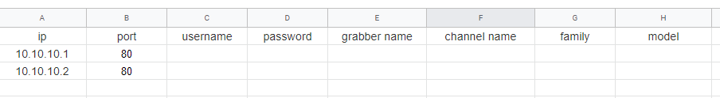

## Основные функции
Добавление и удаление ip-устройств из списка в формате .csv

## Установка
- Перейти в автоматизацию, нажать «Загрузить пример» и выбрать «Из файла», указав путь к скрипту.
- Снять галочку «Включить скрипт» и нажать сохранить.
- Выполнить настройку и нажать "Сохранить и запустить".

## Настройка

При считывании **.csv** файла первая строка пропускается, т.к. она используется для заголовков. В качестве разделителя может использоваться "," либо ";"

## Примеры заполненных файлов

Добавление IP устройств

    
     Возможные варианты добавления IP устройств:
    <ul>
        <li>Добавление с указанием конкретной модели.</li>
        <li>Добавление с использованием автоопределения.</li>
        <li>Добавление через ONVIF/RTSP/File.</li>
    </ul>
    Нюансы заполнения .csv файла:
    <ul>
        <li>Имя IP устройства и имя канала одинаковые - в таком случае в конец названия IP устройства будет добавлено подчеркивание "_", для того чтобы избежать дальнейших проблем с одинаковыми именами.</li>
        <li>Имя IP устройства/канала не указываются в .csv файле,в таком случае Трассиром будет присвоено эталонное имя (по модели устройства).</li>
        <li>IP устройство из .csv файла уже добавлено на сервер, в таком случае будут установлены те настройки которые заданы в .csv файле.</li>
        <li>Поля family/model  - не чувствительны к регистру.</li>
    </ul>

 Удаление IP устройств

    Для удаления IP устройств с сервера в .csv файле достаточно будет указать только IP адрес устройства и порт, остальные данные     необязательны для заполнения.
     

**Absolute path to file(csv) -** абсолютный путь к .csv файлу.

**Server -** сервер для работы со скриптом.

**Timeout between adding cameras(sec) -** время между добавлением камер на сервер (секунды).

**Timeout arming camera ONVIF/Autodetect(sec) -** время в течение которого будет происходить попытка определения камеры, актуально для ONVIF и автоопределения (секунды).

**Command:**

- **create** - добавляет IP устройства на сервер из .csv файла.
- **delete** - удаляет IP устройства на сервере, которые присутствуют в .csv файле. 

**Debug mode -** режим отладки.