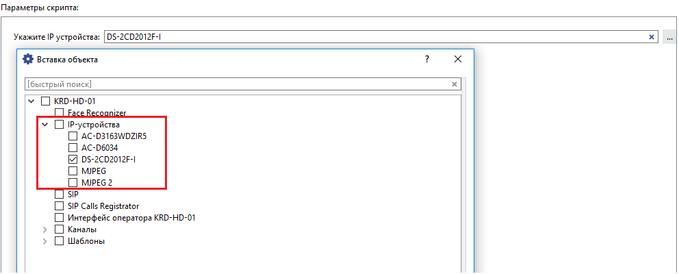

## Основные функции

Отключает ошибку "Неправильная модель" в настройках IP-устройства

## Установка

* Перейти в автоматизацию, нажать «Загрузить пример» и выбрать «Из файла», указав путь к скрипту.
* Снять галочку «Включить скрипт» и нажать сохранить.
* Нажать кнопку "Параметры" и в настройках указать требуемые IP-устройства

* Поставить галочку «Включить скрипт» и нажать "Сохранить и запустить"
* По завершению скрипт лучше удалить