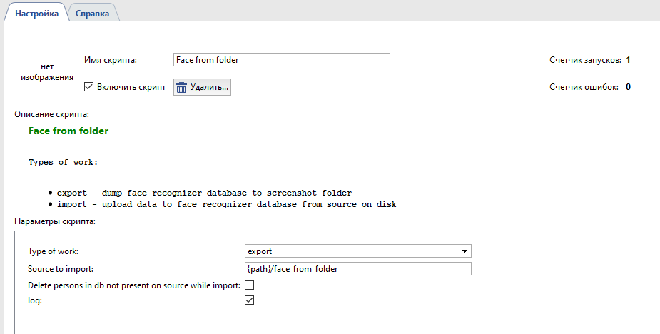
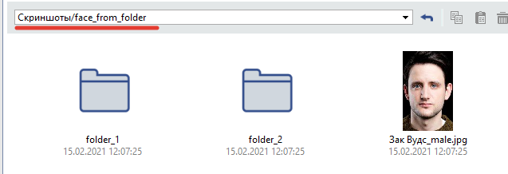
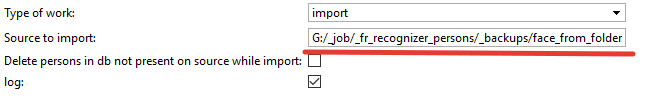
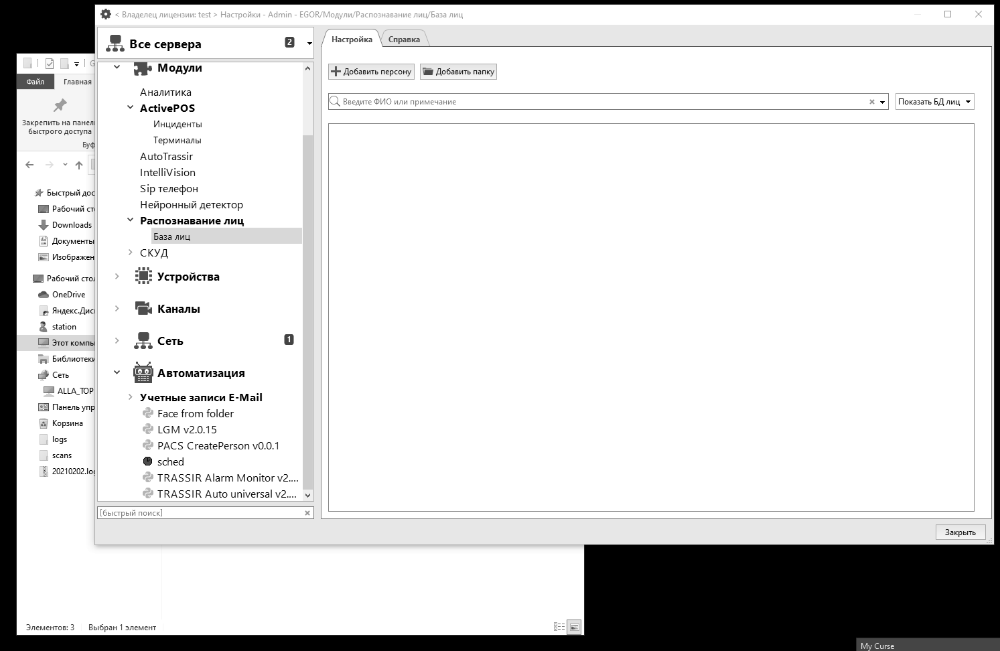

# Face from folder 

### Основные функции
* Добавление персон из заранее подготовленных фотографий с сохранением структуры и имён папок в базу лиц.
* Выгрузка фото персон из базы лиц с сохранением структуры и имён папок.

### Установка

Скрипт необходимо добавить в разделе Автоматизация → Новый скрипт → Загрузить пример → Из файла…
После загрузки скрипта необходимо нажать на кнопку «Сохранить, запустить» и выполнить его настройку.

### Настройка
#### Сохранение фотографий персон в папку скриншотов

1. В поле 'Type of work' выбрать export
2. Нажать 'Сохранить и запустить'

#### Загрузка фотографий персон в БД лиц.

1. В поле 'Type of work' выбрать import
2. Поместить паки и файлы с фото лиц в папку face_from_folder: 

Возможно произвести импорт из другой доступной паки, для этого нужно прописать полный путь, в качестве разделителей используйте прямой слеш: 

В имени файла фото возможно указать пол через подчеркивание, например: Екатерина Метвеевна_female.jpg. По умолчанию устанавливается мужской род.

