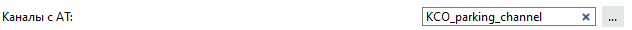

# Auto Universal (Автоюниверсал)

<strong>Внимание. Скрипт запускается на сервере.</strong>

## Основные функции

Скрипт предназначен для реагирования на события распознавания номера.

### При распознавании номера при помощи скрипта возможно: 
<ul>
	<li>
		Воспроизвести простые реакции - вывести текст, проиграть звук, сохранить скриншот.
	</li>
	<li>Открыть шлагбаум по замыканию тревожного входа</li>
	<li>Операции со СКУД</li>
	<li>Отправка e-mail сообщений со скриншотом</li>
	<li>Вывод на отображение камер с тревогой</li>
	<li>Открытие архива на моменте тревоги</li>

</ul>

### Отсортировать тревоги по:

<ul>
	<li>Направлению движения</li>
	<li>Спискам (Белый, Черный, Информативный)</li>
</ul>

Так же в скрипт встроена возможность вывода нескольких камер при одновременном распознавании номера и расписание работы.
Скрипт может работать в связке с [Alarm Monitor](https://confluence.trassir.com/display/SCR/Alarm+Monitor) для получения уведомлений.

## Установка

Скрипт необходимо добавить в разделе Автоматизация → Новый скрипт → Загрузить пример → Из файла.
После загрузки скрипта необходимо нажать на кнопку «Сохранить, запустить», снять галочку «Включить скрипт» и выполнить его настройку.

## Настройка скрипта 
<ul>
	<li>
		Выбрать канал(ы) для работы  на которых происходит распознавание автомобильных номеров  
		  		
	</li>
	<li>
		Выбрать список на который будет дальнейшая реакция   
		  
	</li>
	<li>Указать имя списка (несколько через запятую). Например, номер находится в трех информационных списках, а реагировать нужно только на список с именем Test1. Если поле оставить пустым фильтр по имени не применяется.  
		  
	</li>
	<li>Выбрать задержку перед повторным распознаванием номера</li>
	<li>Выбрать направление движения по кадру (машина движется на камеру - Вниз, от камеры - Вверх)</li>
	<li>Если используется распознаватель номера на камере (аппаратный детектор) событие от которого не сдержит направление движения, то необходимо отметить чекбокс "Используется детектор HW" </li>
	<li><strike>Если необходимо, чтобы скрипт искал похожий номер при неполном распознавании номера/ распознавании с ошибкой, то необходимо отметить "Включить погрешность распознания номера".</strike> Теперь работа с погрешностью происходит на уровне базового ПО.</li>
</ul>

### Реакции по событиям

В разделе "Реакции по событиям" выбирается тот тип действий, который необходимо произвести при распознавании номера из заданного списка:

<ul>
  <li>Выполнить операции с тревожными выходами</li>
  <li>Выполнить операции с точкой доступа СКУД</li>
  <li>Включить вывод канала на отображение</li>
  <li>Выполнить операции с тревожными выходами</li>
  <li>Сохранить снимок локально</li>
  <li>Отправить снимок по FTP</li>
  <li>Отправить снимок на e-mail</li>
  <li>Отправить снимок в Telegram</li>
  <li>Отправить уведомление на e-mail</li>
  <li>Отображать текстовое сообщение</li>
  <li>Проиграть звуковое оповещение</li>
  <li>Вывести всплывающее окно</li>
</ul>

Для  некоторых типов реакций необходимо произвести дополнительные настройки в разделах, которые находятся ниже.
В разделе <b>"Дополнительно"</b> задаются вспомогательные параметры.

<dl>
  <dt>Коррекция времени скриншота (до события)</dt>
  <dd>Иногда необходимо сделать скриншот за некоторое время до наступления события, например при событии "Саботаж". Важно понимать, что такой скриншоты может быть сделан только из архивной записи. Поэтому если архив в этот момент не писался, то будет получен скриншот ближайшего момента, за который была сделана запись.</dd>

  <dt>Скриншот с потока камеры.</dt>
  <dd> Если архив не пишется на диски устройства, но необходимо сохранять скриншоты событий, то следует выбрать данный пункт.</dd>

  <dt>Скриншоты с фигурами. </dt>
  <dd>Скриншот с фигурами может быть получен только если архив пишется на диски сервера. При использовании скриншота с потока камеры эта функция не работает.</dd>

  <dt>Время хранения скриншотов.</dt>
  <dd>Если в разделе "Реакции по событиям" выбрано "Сохранить снимок локально", то скрипт сохраняет скриншоты в каталог скриншотов. Если этот параметр больше нуля, то скрипт будет удалять скриншоты время жизни которых больше заданного параметра.</dd>

  <dt>Расписание для работы скрипта.</dt>
  <dd> Дополнительный параметр, если указано расписание, то скрипт будет отрабатывать, когда заданное расписание находится в указанной зоне.</dd>
</dl>

### Операции с тревожными выходами

Возможно выполнить замыкание, размыкание или последовательность этих действий с тревожными выходами. Тревожных выходов может быть задано несколько.

<dl>
  <dt>Задержка между парными операциями (напр. замкнуть-разомкнуть) </dt>
  <dd>Это то время, которое проходит между двумя последовательными действиями в секундах. Например, если выбран тип работы замкнуть-разомкнуть и параметр задержки составляет 5 секунд, то при наступлении события тревожный выход замкнется и через 5 секунд разомкнётся.</dd>
  
  <dt>Алгоритм работы шлагбаума с очередью</dt>
  <dd>Это то, как будет отрабатывать скрипт когда авто идут один за другим. Подробнее как это работает приведено в примерах ниже.</dd>

  <dt>Пример 1. type_1</dt>
  <dd>Заданные параметры: алгоритм работы шлагбаума с очередью type_1, тип работы 'замкнуть-разомкнуть', задержка перед последующей операцией с тревожным выходом 10 сек.   
  12:00:00 Подъезжает авто №1 номер которого в заданном списке. Тревожный выход замыкается, шлагбаум открывается.  12:00:05 Через 5 секунд, следом за авто №1 подъезжает авто №2 номер которого так же в заданном списке. Время открытого состояния шлагбаума увеличивается на 10 секунд.  12:00:20 Шлагбаум закрывается
  </dd>

  <dt>Пример 2. type_2</dt>
  <dd>Заданные параметры: алгоритм работы шлагбаума с очередью type_2, тип работы 'замкнуть-разомкнуть', задержка перед последующей операцией с тревожным выходом 10 сек. 
    12:00:00 Подъезжает авто №1 номер которого в заданном списке.   Тревожный выход замыкается, шлагбаум открывается. 
    12:00:05 Через 5 секунд, следом за авто №1 подъезжает авто №2 номер которого так же в заданном списке.  
    12.00:10 Тревожный вход размыкается, а затем замыкается, т.е. шлагбаум закрывается и открывается вновь, чтобы пропустить авто №2 
    12:00:20 Шлагбаум закрывается 
    Таким образом различие следующее при выбранном типе type_1 время открытого шлагбаума продлевается , а при type_2 шлагбаум открывается-закрывается для каждого автомобиля в очереди.
  </dd>

  <dt>Пример 3. type_3</dt>
  <dd>Принцип работы с тревожным выходом похож на type_2: шлагбаум открывается-закрывается  для каждой машины. Отличие в следующем: можно регулировать не только время открытого состояния шлагбаума но время задержки перед каждой итерацией открыто/ закрыто.
  Например, к шлагбауму КПП подъехало три машины. Открытое состояние шлагбаума для каждого авто установлено в 7 сек. А параметр 'Таймаут перед обработкой следующего авто type_3' - 10 секунд. Для первого авто шлагбаум откроется на 7 секунд, затем шлагбаум закроется на 10 сек и вновь откроется для второго авто. Причем если проехало три авто и за ними подъехало четвертое, то для него шлагбаум также откроется не раньше, чем через 10 секунд с момента, как шлагбаум закрылся после третьего авто.</dd>
</dl>

### Отправка уведомлений/ снимков на e-mail

Если необходимо отправить простое текстовое уведомление на электронную почту, то следует выбрать "Отправить уведомление на e-mail". Если необходимо такое уведомление с прикрепленным скриншотом, то необходимо выбрать "Отправить снимок на e-mail" 
В разделе "Настройка e-mail" необходимо указать предварительно созданную учетную запись отправителя и получателей через запятую без пробелов. 
Для работы с данным пунктом нужно [создать учетную запись E-mail](https://www.dssl.ru/files/trassir/manual/ru/setup-email-account.html).

### Отправка снимков в Telegram

В разделе "Telegram" необходимо указатьTelegram ID всех пользователей, кому хотите предоставить доступ к серверу с помощью бота.
Для того, чтобы узнать id напишите боту [@trassirbot](https://t.me/trassirbot) команду /tbot и в ответ вы получите сообщение, где будет указан Ваш id:

### Вывод канала на отображение

Данный тип реакции используется для отображения каналов на которых произошло нужное событие.

В разделе "Тревожный монитор" необходимо указать имя тревожного шаблона. Причем шаблон с таким именем должен быть предварительно создан. Раскладка данного шаблона не имеет значения, т.к. скрипт использует стандартные раскладки в зависимости от количества отображаемых каналов. Если необходимо, чтобы после того, как произошло отображение тревожных каналов скрипт переключался на какой-либо базовый шаблон, нужно указать имя данного шаблона в поле "Базовый шаблон".

При выборе типа действия "Открыть момент в архиве" после наступления события через \~5 сек открывается проигрывание архивного видео момента события. При такой настройке на тревожном мониторе может выводиться не более одного канала. Если в течение 5 секунд видео поток не успел записаться на жесткий диск, то проигрывание не начнётся.

