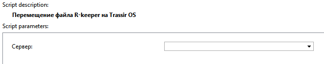

## Основные функции

Скрипт для перемещения файла с настройками на сервер Trassir OS.

## Установка

* Перейти в автоматизацию, нажать «Загрузить пример» и выбрать «Из файла», указав путь к скрипту.
* Снять галочку «Включить скрипт» и нажать сохранить.
* Устанавливается на клиентскую часть под Windows.
* Выполнить настройку и нажать "Сохранить и запустить"

## Настройки скрипта

