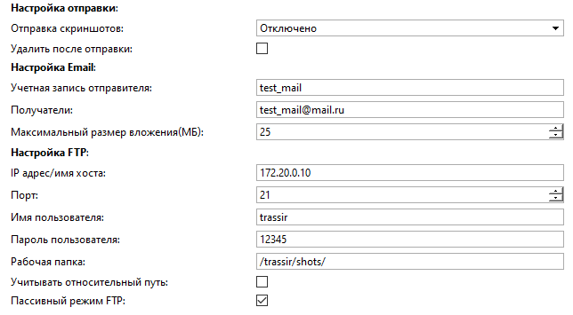

## Основные функции
Скрипт предназначен для автоматизированного сохранения скриншотов.

## Возможности скрипта
<ul>
    <li>Сохранение скриншотов:
    	<ul>
            <li>Онлайн:
            	<ul>
                    <li>каждые <strong>N</strong> секунд;</li>
                    <li>по <strong>расписанию</strong> (при переходе в красную зону);</li>
                    <li>по <strong>нажатию клавиши:</strong>
                    	<ul>
                            <li>с выбранных каналов;</li>
                            <li>с активного канала;</li>
                        </ul>
                    </li>
                </ul>
            </li>
            <li>Из архива - за промежуток времени с заданным интервалом;</li>
        </ul>
    </li>
    <li><strong>Выбор каналов</strong> для скриншотов;</li>
    <li><strong>Выбор пути сохранения</strong> скриншотов с учетом имени канала, имени сервера, даты и времени;</li>
    <li><strong>Отправка скриншотов:</strong>
    	<ul>
            <li>на FTP сервер</li>
            <li>на почту либо FTP сервер (начиная с версии 3.2.0)</li>
        </ul>
    </li>
</ul> 

## Установка
* Перейти в автоматизацию, нажать «Загрузить пример» и выбрать «Из файла», указав путь к скрипту.
* Снять галочку «Включить скрипт» и нажать сохранить.
* Выполнить настройку и нажать "Сохранить и запустить".

Основные настройки

    
    <table>
        <thead>
          <tr>
            <th>Параметр</th>
            <th>Описание</th>
          </tr>
        </thead>
        <tbody>
          <tr>
            <td>Сервер</td>
            <td>Сервер, к которому подключены каналы</td>
          </tr>
          <tr>
            <td>Каналы</td>
            <td>Список каналов через запятую, не обязательный параметр.
            	 Если каналы не указаны - скрипт будет работать со всеми доступными каналами.
                 Если указать неверное имя канала, то скрипт выдаст ошибку ObjectsNotFoundError: Не найдены объекты
            </td>
          </tr>
          <tr>
            <td>Путь, относительно папки скриншотов</td>
            <td>Путь сохранения относительно папки скриншотов.
              	 По умолчанию: {server.name}/%Y.%m.%d/{channel.name}
                 При указании пути сохранения скриншотов доступны следующие переменные:
                	<ul>
                    	<li>{server} - Объект настроек сервера;</li>
                        <li>{channel} - Объект настроек канала;</li>
                        <li>%Y.%m.%d - Дата и время, <a href="https://strftime.org/">https://strftime.org</a></li>
                	</ul>
                Если Вам необходимо изменить стандартный путь для папки скриншотов на TrassirOS воспользуйтесь скриптом <a href=#>Change screenshots folder</a>
            </td>
          </tr>
          <tr>
            <td>Время ожидания скриншота</td>
            <td>Скрипт ожидает появления скриншота в течении заданного времени.
                 Если скриншот не появился - создается повторный запрос на создание скриншота.
                 Если во второй раз скриншот не удалось сохранить - в лог выводится соотвествующая информация.
            </td>
          </tr>
          <tr>
            <td>Режим отладки</td>
            <td><strong>True</strong> - Активирует запись подробных логов</td>
          </tr>
        </tbody>
    </table>

Скриншоты онлайн

    
    <table>
        <thead>
          <tr>
            <th>Параметр</th>
            <th>Описание</th>
          </tr>
        </thead>
        <tbody>
          <tr>
            <td>Каждые n сек</td>
            <td>Активирует сохранения скриншотов каждые <strong>N</strong> секунд.
                 <strong>0</strong> - отключено.
                 Интервал сохранения скриншотов не может быть меньше количества каналов + 1. 
                 Например, если необходимо сохранять скриншоты с 10 каналов - интервал не может быть меньше 11 сек. 
                 В противном случае вы получите ошибку ValueError: Delay is too short, for 10 channels you need more than 11 seconds delay
            </td>
          </tr>
          <tr>
            <td>По расписанию (Red)</td>
            <td>Если расписание выбрано - активирует сохранение скриншотов при переходе расписания в красную зону.
                 <a href="https://www.dssl.ru/files/trassir/manual/ru/setup-schedule.html">Как создать расписание?</a>
            </td>
          </tr>
          <tr>
            <td>Время  ожидания загрузки расписания (сек)</td>
            <td>Время в течение которого скрипт будет пытаться получить доступ к расписанию.
                 Актуально для ситуаций, когда сервер только включился и скрипт загрузился быстрее чем расписание.
            </td>
          </tr>
          <tr>
            <td>По нажатию клавиши(для выбранных каналов)</td>
            <td>Если клавиша выбрана - при нажатии сохраняет скриншоты с указанных в параметрах каналов.</td>
          </tr>
          <tr>
            <td>По нажатию клавиши(для активного канала)</td>
            <td>Если клавиша выбрана - при нажатии сохраняет скриншот с последнего активного канала.
                 При этом скриншот также сохраняется в указанную папку с учетом переменных и отправляется на почту или ftp согласно настройкам скрипта.
            </td>
          </tr>
          <tr>
            <td>По событию</td>
            <td>Активирует сохранения скриншотов по событию. Тип события необходимо указывать на латинице.</td>
          </tr>
          <tr>
            <td>Только события с выбранных объектов</td>
            <td>Если объект выбран - активирует сохранение скриншотов по событию, которое указано в поле "По событию" для данного объекта.
                Данное поле можно оставить пустым, не указывая объекты, в таком случае сохранение скриншотов будет происходит по событию которое указано в поле "По событию", без привязки к конкретному объекту, 
            </td>
          </tr>
        </tbody>
    </table>

Скриншоты из архива

    
    <table>
        <thead>
          <tr>
            <th>Параметр</th>
            <th>Описание</th>
          </tr>
        </thead>
        <tbody>
          <tr>
            <td>Интервал между скриншотами, мин</td>
            <td>Активирует сохранение скриншотов из архива с указанным интервалом. <strong>0</strong> - отключено.</td>
          </tr>
          <tr>
            <td>Фигуры</td>
            <td>Вкл/Выкл сохранение скриншотов с фигурами из архива</td>
          </tr>
          <tr>
            <td>Дата начала</td>
            <td>Задает дату начала промежутка для сохранения скриншотов</td>
          </tr>
          <tr>
            <td>Время начала</td>
            <td>Задает время начала промежутка для сохранения скриншотов</td>
          </tr>
          <tr>
            <td>Дата окончания</td>
            <td>Задает дату окончания промежутка для сохранения скриншотов</td>
          </tr>
          <tr>
            <td>Время окончания</td>
            <td>Задает время окончания промежутка для сохранения скриншотов</td>
          </tr>
        </tbody>
    </table>

Настройки отправки

    
    <table>
        <thead>
          <tr>
            <th>Параметр</th>
            <th>Описание</th>
          </tr>
        </thead>
        <tbody>
          <tr>
            <td>Отправка скриншотов</td>
            <td>Возможные варианты: Отключено, Email, FTP</td>
          </tr>
          <tr>
            <td>Удалить после отправки</td>
            <td>Удаляет локальный файл скриншотов после отправки</td>
          </tr>
          <tr>
            <td colspan="2"><strong>Настройка Email</strong></td>
          </tr>
          <tr>
            <td>Учетная запись отправителя</td>
            <td>Имя учетной записи email в ПО Трассир. <a href="https://www.dssl.ru/files/trassir/manual/ru/setup-email-account.html">Инструкция</a> по созданию учетной записи.</td>
          </tr>
          <tr>
            <td>Получатели</td>
            <td>Email адрес получателя, возможно указать несколько через запятую.</td>
          </tr>
          <tr>
            <td>Максимальный размер вложения(МБ)</td>
            <td>При отправке вложений большинство email сервисов ограничивают размер вложений.
                 Данное поле позволяет задать максимальное значение вложений (по умолчанию 25 MB).  При отправке нескольких файлов сообщения автоматически разделяться на несколько (с учетом того, что общий размер вложений будет меньше указанного)</td>
          </tr>
          <tr>
            <td colspan="2"><strong>Настройка FTP</strong></td>
          </tr>
          <tr>
            <td>IP адрес/имя хоста</td>
            <td>Адрес ftp сервера</td>
          </tr>
          <tr>
            <td>Порт</td>
            <td>Порт ftp сервера, по умолчанию 21</td>
          </tr>
          <tr>
            <td>Имя пользователя</td>
            <td>Имя пользователя ftp сервера</td>
          </tr>
          <tr>
            <td>Пароль пользователя</td>
            <td>Пароль пользователя ftp сервера</td>
          </tr>
          <tr>
            <td>Рабочая папка</td>
            <td>root папка на ftp сервере</td>
          </tr>
          <tr>
            <td>Учитывать относительный путь</td>
            <td>Если активно - создает на ftp сервере папку (согласно настройкам относительного пути сохранения скриншота)</td>
          </tr>
          <tr>
            <td>Пассивный режим FTP</td>
            <td>Активация пассивного режима работы FTP</td>
          </tr>
        </tbody>
    </table>

