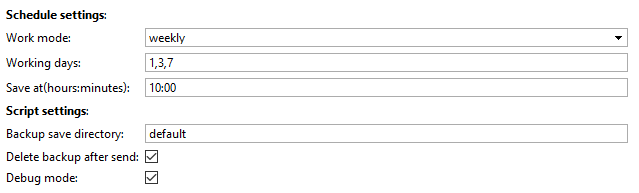
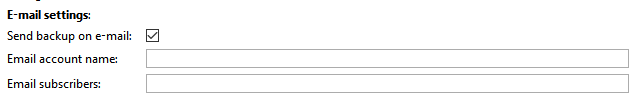
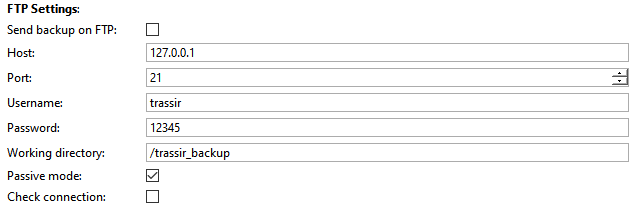

## Основные функции
Скрипт предназначен для автоматического создания бэкапа настроек сервера(файла лицензии), клиента.
Это универсальное решение которое поддерживает работу с платформами Windows/TrassirOS/ARM.
Возможные действия:
1. Автоматическое создание бэкапа по расписанию.
2. Сохранение резервной копии настроек и последующей отправкой:
	* На почту
	* FTP сервер

## Установка
* Перейти в автоматизацию, нажать «Загрузить пример» и выбрать «Из файла», указав путь к скрипту.
* Снять галочку «Включить скрипт» и нажать сохранить.
* Выполнить настройку и нажать "Сохранить и запустить".

## Настройка скрипта

**Work mode** - режим работы скрипта. Возможные варианты:

* weekly - работает с днями недели
* monthly - работает с датами
Working days - дни для работы скрипта, возможно указать несколько перечислив их через запятую.

Примеры использования:

* Work mode = weekly, Working days = 1,3,7 - днями для отправки будет: понедельник, среда, воскресенье.
* Work mode = monthly, Work days = 1,3,7 - днями для отправки будет 1,3,7 число текущего месяца. В случае если указанной даты нет в текущем месяце, скрипт будет делать бэкап в последний день месяца.

**Save at(hours:minutes) -** время сохранения бэкапа. Задается в формате часы:минуты, так же возможно указать с учетом секунд часы:минуты:секунды.

**Backup save directory -** директория сохранения бэкапа:

- В данном поле указано default либо оно пустое - бэкап будет сохраняться в папку скриншотов (в зависимости от того где запущен скрипт) Трассир.
- Указано имя папки - бэкап будет сохранен в эту папку(относительно папки скриншотов Трассир), в случае если данной папки не существует, то скрипт попробует ее создать.

**Delete backup after send -** удаление бэкапа после отправки на почту/ftp.

**Debug mode -** режим отладки, лог скрипта пишется в основной лог Trassir.

**Send backup on e-mail -** активация отправки бэкапа на почту.

**Email account name -** имя учетной записи email в ПО Trassir. [Как создать учетную запись E-Mail?](https://www.dssl.ru/files/trassir/manual/ru/setup-email-account.html)

**Email subscribers -** email адрес получателя, возможно указать несколько через запятую.

**Send backup on FTP -** активация отправки бэкапа на ftp.

**Host -** ip адрес сервера.

**Port -** порт.

**Username -** имя пользователя.

**Password -** пароль.

**Working directory -** рабочая директория на ftp сервере.

**Passive mode -** пассивный режим работы ftp.

**Check connection -** проверка соединения с ftp при старте скрипта.

При отправке бэкапов на почту или ftp сервер рекомендуем удалять файлы после отправки.