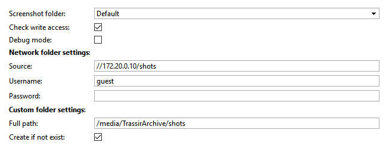
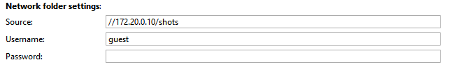
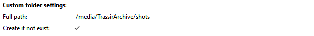

## Основные функции
Скрипт изменяет папку скриншотов на серверах TrassirOS.

Если при установке новой папки возникли ошибки - скрипт сделает еще две попытки изменить папку.
Чаще всего ошибки могут возникнуть при монтировании сетевой папки (при вводе неверных данных для подключения) или папки на HDD (при отсутствии в системе диска).

## Установка
* Перейти в автоматизацию, нажать «Загрузить пример» и выбрать «Из файла», указав путь к скрипту.
* Снять галочку «Включить скрипт» и нажать сохранить.
* Выполнить настройку и нажать "Сохранить и запустить".

## Настройка
Возможные значения параметра *Screenshot folder*:

Default

Устанавливает стандартный путь для сохранения скриншотов - /home/trassir/shots

HDD

Устанавливает папку на жестком диске сервера в качестве папки скриншотов.
 Для выбора папки используется встроенная функция host.path_arbitrary_data() что позволяет избежать проблем  
при наличии нескольких HDD в системе, т.к. пути /media/TrassirArchive* монтируются динамически и при каждой загрузке меняются.
Примерное расположение скриншотов при выборе данной опции - /media/TrassirArchive/TrassirArbitraryData/shots 
 При наличии нескольких дисков в системе - скрипт должен обязательно оставаться в рабочем состоянии. 
 Если в системе нет ни одного HDD скрипт выдаст ошибку:
 ERROR: EnvironmentError: HDD Not Found!
 Make sure at least 1 HDD is active.
 Restart script. If you see this message again - contact with support@dssl.ru

Network (CIFS)

    Мы не можем гарантировать стабильную работу трассира с общей сетевой папкой, поэтому используйте данный параметр в крайнем случае!
    
     Монтирует общую сетевую папку в локальную /mnt/LocalStorage/shared после чего устанавливает ее в качестве папки скриншотов.
     Монтирование папки реализуется по протоколу CIFS.
     При этом чтобы расшарить папку на <strong>Windows 10</strong> необходимо предварительно включить компонент Windows: SMB 1.0/CIFS File Sharing Support (название компонента может отличаться в зависимости от версии Windows). На более ранних версиях Windows данный компонент может отсутствовать, соотвественно поддержка данного протокола включена по умолчанию.
     При расшаривании папки обязательно укажите пользователя и пароль.
Анонимный доступ может не сработать, даже если в настройках доступа к расшареной папке разрешено чтение/изменение всем.
     При потере соеднения с папкой все обращения к папке скриншотов могут "подвесить" trassir на 120 сек.

Custom

    
     Устанавливает папку, которая указана в параметре Custom folder settings → Full path.
     При использовании данного параметра мы не можем гарантировать стабильную работу сервера Trassir.
Используйте с осторожностью! 

