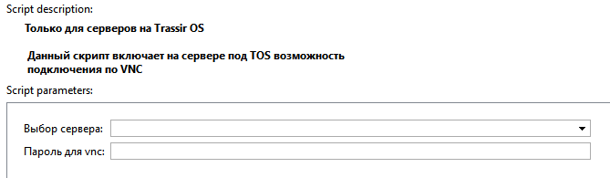

## Основные функции

Включает возможность удаленного доступа через клиент VNC на сервера под управлением Trassir OS.

## Установка

* Перейти в автоматизацию, нажать «Загрузить пример» и выбрать «Из файла», указав путь к скрипту.
* Снять галочку «Включить скрипт» и нажать сохранить.
* Выполнить настройку и нажать "Сохранить и запустить".

## Настройки скрипта

