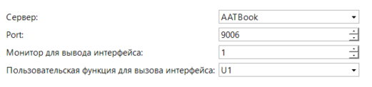

## Основные функции
Скрипт предназначен для подключения сервера со скриптом [Analytics](#) и [Parking ](#)и других скриптов к клиентской части Trassir.
Данный скрипт устанавливается на клиентскую часть Trassir и передает данные аналитического модуля на веб - интерфейс.

## Установка
* Добавить скрипт в разделе Автоматизация->Новый скрипт->Загрузить пример->Из файла.
* После загрузки скрипта необходимо нажать на кнопку «Сохранить, запустить».
* Выключить скрипт, сняв чек-бокс и выполнить его настройку.
* После выбора нужных реакций и тревог, включить скрипт.

## Настройка скрипта

1. Выбрать сервер с аналитическим модулем(скриптом).
2. Выбрать порт (в зависимости от модуля, которое необходимо отобразить на клиенте).

> Порт должен быть доступен от сервера с со скриптом до клиентской части, куда установлен данный скрипт.

3. Выбрать монитор, на котором необходимо открыть интерфейс.

4. Выбрать нужную функцию, запускать вы ее будете в интерфейсе оператора по кнопке: 

   

## Порты
* 9002 - Паркинг
* 9003 - Некоторые индивидуальные разработки
* 9006 - Аналитика
* 9009 - TFortis
* 9011 - Trassir Switches