# AlarmMonitor (Тревожный монитор)

Данный скрипт является универсальным инструментом для информирования пользователя о наступлении событий, которые детектирует Trassir, а так же он умеет выполнять простые действия, такие как: замыкание тревожных выходов, подача сигналов открытия в СКУД, сохранение скриншотов событий, отправление уведомлений и скриншотов на e-mail, Telegram (только на сервере), SMS [сервис smsc.ru](https://www.smsc.ru)

Необходимо отметить, что логика работы скрипта строится "от канала".  Даже такие события, как замыкание / размыкание тревожного входа ассоциируются с определёнными каналами.

В верхней части параметров скрипта необходимо выбрать типы событий на которые нужно реагировать и типы реакций на эти события. Для некоторых событий и реакций необходимо произвести настройки в разделах, которые находятся ниже.

<h3>Типы событий на которые умеет реагировать скрипт:</h3>
<ul>
  <li>Распознавание лиц</li>
  <li>События нейродетектора (появление объекта в зоне, нахождение объекта в зоне заданное время, пересечение линии)
  </li>
  <li>тревога о превышении температуры (Событие о детектировании превышения температуры человека, при использовании интегрированных в Trassir камер с тепловизором)
  </li>
  <li>Появление движения
  </li>
  <li>Обнаружение лица на изображении
  </li>
  <li>Реакция на SMART события с камер Hikvision: тревога при пересечении границы, тревога при вторжении в зону.</li>
  <li>Появление (детектирование) звука.</li>
  <li>Появление огня или дыма</li>
  <li>Затухание огня</li>
  <li>Появление оставленного предмета</li>
  <li>Саботаж</li>
  <li>События от детектора SIMT</li>
  <li>замыкание/ размыкание тревожного входа</li>
  <li>События от охранной системы системы Orion, Sigur</li>
  <li>События от скрипта интеграции с системой ВОРОН</li>
  <li>События от скрипта AutoUniversal</li>
  <li>События от СКУД GATE</li>
  <li>Обнаружения aruco кода на изображении</li>
  <li>События от модуля Social distance detector</li>
  <li>События от модуля Face mask detector</li>
</ul>

<h3> Типы реакций при наступлении заданных событий:</h3>

<ul>
  <li>Вывод канала, на котором произошла тревога на отображение в графическом интерфейсе Trassir.</li>
  <li>Сохранение скриншота события на локальный диск</li>
  <li>Отправление описания тревоги и скриншота на e-mail</li>
  <li>Отправление описания тревоги и скриншота в Telegram (только на сервере)</li>
  <li>Отправление скриншота на FTP</li>
  <li>Отправление уведомления по SMS</li>
  <li>Отображение текстового сообщения с информацией о событии</li>
  <li>Вызов всплывающего окна с информацией о событии</li>
  <li>Проигрывание звука</li>
  <li>Отправление кода на SIP домофон для открытия двери (только на сервере)</li>
  <li>Генерация тревоги</li>
</ul>

<h3>Установка</h3>
Скрипт необходимо добавить в разделе Автоматизация → Новый скрипт → Загрузить пример → Из файла…
После загрузки скрипта необходимо нажать на кнопку «Сохранить, запустить» и выполнить его настройку.

<h3>Настройка</h3>

В верхней части параметров скрипта необходимо выбрать типы событий на которые нужно реагировать и типы реакций на эти события. Для некоторых событий и реакций необходимо произвести настройки в разделах, которые находятся ниже.

В разделе <b>"Дополнительно"</b> задаются вспомогательные параметры.

<dl>  
  <dt>Серверы в работе.</dt>
  <dd>Серверы, с объектами которых необходимо работать. К данным объектам относятся прежде всего каналы, а так же тревожные входы, выходы, зоны, границы и т.п.</dd>
  
  <dt>Каналы в работе.</dt>
  <dd>Только те каналы, с которых необходимо отслеживать заданные события. Работает как фильтр. Если задан сервер, но не заданы каналы, то скрипт будет реагировать на события со всех каналов этого сервера.</dd>
  
  <dt>Коррекция времени скриншота. </dt>
  <dd>Иногда необходимо сделать скриншот за некоторое время до наступления события, например при событии "саботаж" или после, например при детектировании движения. Важно понимать, что такой скриншоты может быть сделан только из архивной записи. Поэтому если архив в этот момент не писался, то будет получен скриншот ближайшего момента, за который была сделана запись. Параметр задаётся со знаком минус, если требуется делать шот момента до наступления события.</dd>
  
  <dt>Время буферизации</dt>
  <dd>Параметр 'время буферизации' помогает в тех случаях, когда архив с канала пишется в двух потоках. Как правило, субпоток записывается раньше в следствии чего скриншот формируется с субпотока. Чтобы получить шот основного потока нужно подождать в течение времени буферизации</dd>
  
  <dt>Скриншот с потока камеры</dt>
  <dd>Если архив не пишется на диски устройства, но необходимо сохранять скриншоты событий, то следует выбрать данный пункт</dd>

  <dt>Скриншоты с фигурами</dt>
  <dd>Скриншот с фигурами может быть получен только если архив пишется на диски сервера. При использовании скриншота с потока камеры эта функция не работает</dd>
  
  <dt>Время хранения скриншотов</dt>
  <dd>Если в разделе "Реакции по событиям" выбрано "Сохранить снимок локально", то скрипт сохраняет скриншоты в каталог скриншотов. Если этот параметр больше нуля, то скрипт будет удалять скриншоты время жизни которых больше заданного параметра.</dd>

  <dt>Расписание для работы скрипта.</dt>
  <dd>Дополнительный параметр, если указано расписание, то скрипт будет отрабатывать, когда заданное расписание находится в красной зоне.</dd>
</dl>

<h3> Работа по событиям распознавания лиц </h3>

<h4> Настройка параметров скрипта для работы по событиям распознавателя лиц</h4>

    
Выполнить следующие настройки:

    <ul>
      <li>В разделе "Типы тревоги" необходимо выбрать чекбокс "Тревога по событиям распознавателя лиц"  
          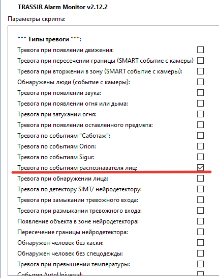  
      </li>
      <li>В разделе "Дополнительно" указываем серверы и каналы с этих серверов. Только с этих каналов скрипт будет обрабатывать события. На данных каналах должен быть включен "Трекер/ распознаватель лиц".  
        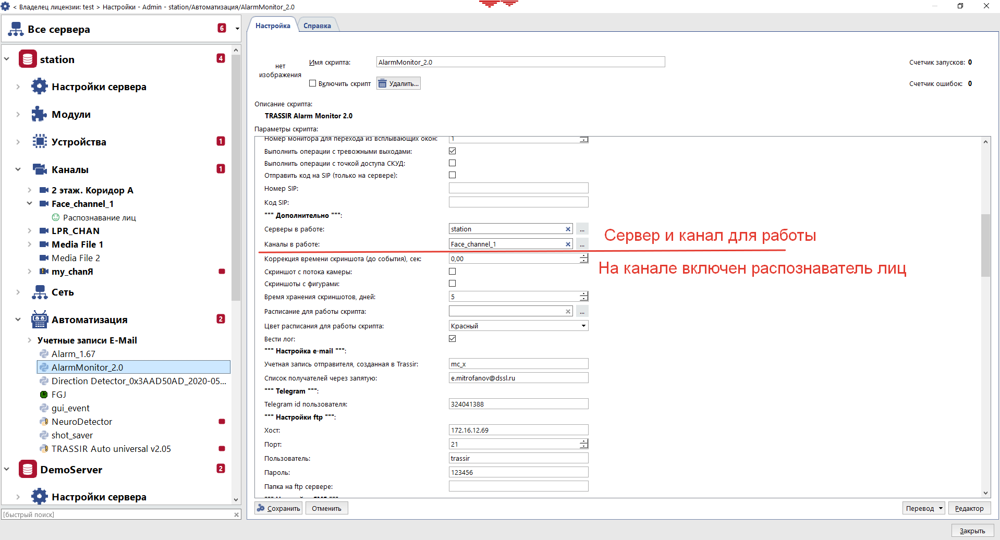  
      </li>
      <li>В разделе "Распознаватель лиц" необходимо выбрать сервер с нужными папками персон (группами)  
      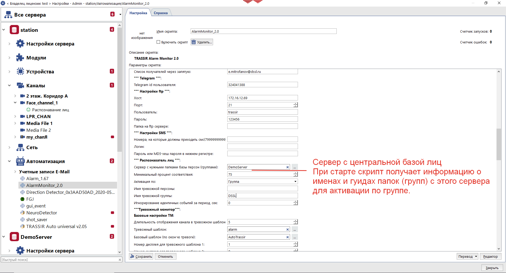  
      </li>
      <li>
        В случае если скрипт запускается на сервере, на котором используется синхронизация лиц с центрального сервера, в этом окне указывается имя центрального сервера. 
        При включении скрипта этот сервер должен быть доступен, также у учётной записи Script должны быть права на чтение настроек центрального сервера, для получения информации об именах папок и их id  
        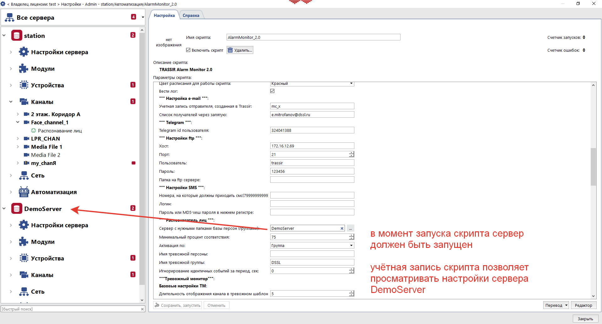  
      </li>
    </ul>

<h4> Дополнительная информация по работе скрипта по распознаванию лиц.</h4>

<ul>
  <li>
    При использовании синхронизации БД лиц с центрального сервера для корректной работы скрипта необходимо, чтобы БД лиц была синхронизирована с центральным сервером  
    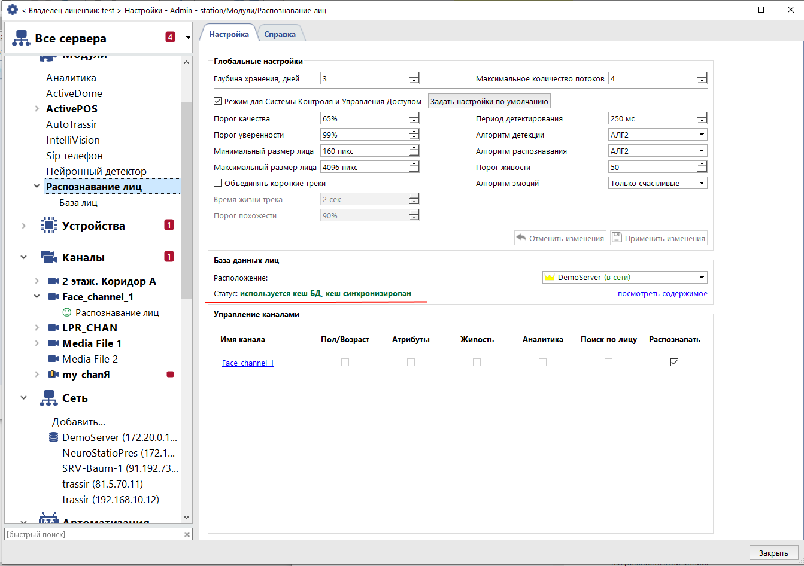  
  </li>
  <li>
    Скрипт можно настроить на реакцию на несколько групп. Для этого в поле "Имя тревожной группы" необходимо указать несколько имён групп через запятую.
      
    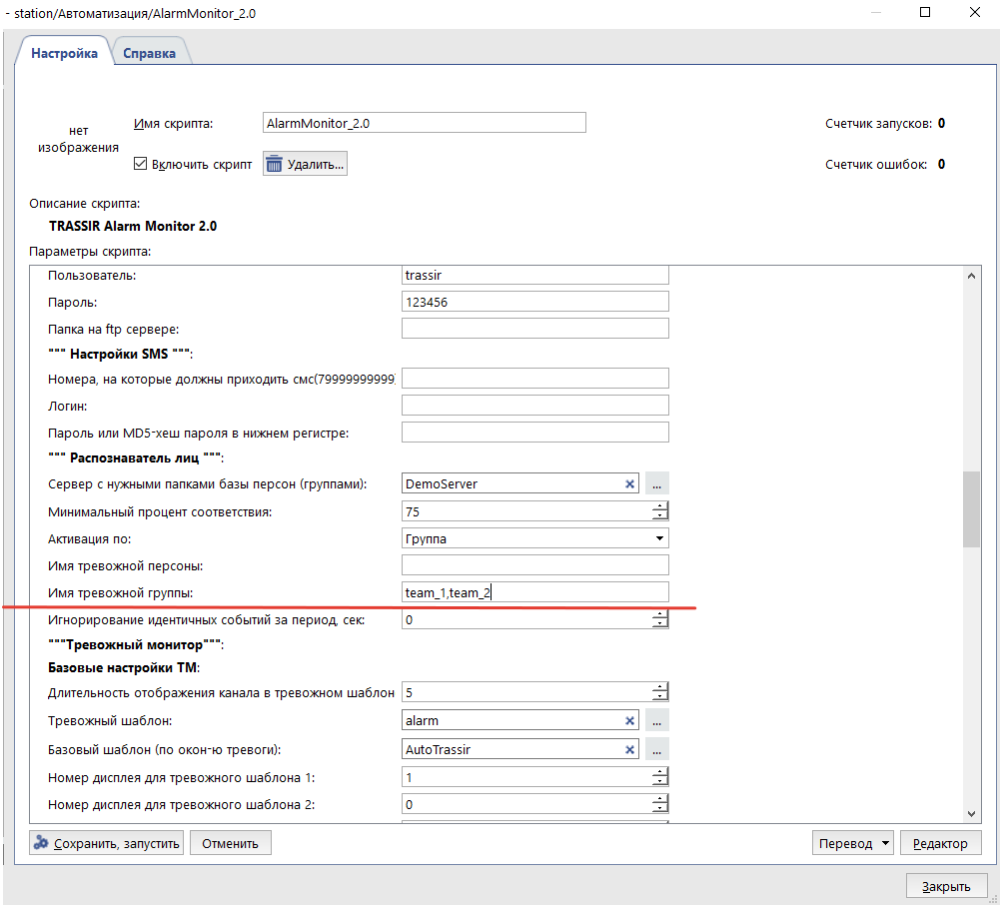  
  </li>
  <li>
    При запуске скрипта на сервере и выборе отправки скриншота в Telegram или на email, помимо самого скриншота, прикрепляется фото из БД распознанной персоны и лучший трек с распознанным лицом.  
    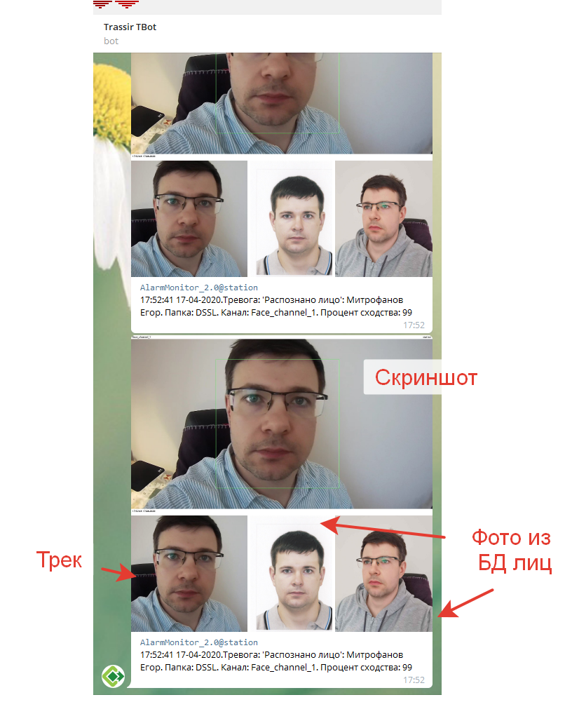  
  </li>
  <li>
    Для игнорирования идентичных событий за период, необходимо в одноимённом поле задать положительное значение периода игнорирования в секундах.  Это работает так: при распознавании лица из БД, скрипт запоминает время события и если событие повторяется, т.е. персона распознаётся повторно на том же канале в течение заданного времени, то это событие игнорируется.
  </li>
  <li>
    При работе на сервере скрипт умеет реагировать на события распознавания лица на канале сервера добавленного по рекурсии.    
  </li>
</ul>

<h3>Работа по событиям нейродетектора.</h3>
<h4>Настройка скрипта на события вхождения объекта в зону.</h4>

Существует три варианта работы.

<h4>Вариант 1. Моментальная реакция.</h4>

Необходимо отметить чекбокс "Тревога по детектору SIMT/ нейродетектору" и в разделе "Настройки SIMT/нейродетектора"
в поле "Тревога при входе в зоны (\*simt, neuro) указать названия нужных зон.
Достоинством данного способа является его простота, но нет возможности выбрать тип объекта (авто, человек, вело),
не возможно задать количество объектов. 
При вхождении объекта в зону скрипт моментально вызывает реакцию. 
Существует возможность задать время "Игнорирования идентичных событий за период". События одного канала и одной зоны
считаются идентичными.

<h4> Вариант 2 - a,b</h4>

Для a и b необходимо отметить чекбокс "Появление объекта в зоне нейродетектора". Выполнить необходимые настройки в
разделе "Настройки нейронного детектора":
<h4>Вариант 2-a. Моментальная реакция.</h4> 

Моментальная реакция на появления объекта или нескольких объектов в зоне, количество и тип объектов задается
в соответствующих полях.

В поле 'тип работы для детекции в зоне' необходимо выбрать immediate, выбрать зоны для детекции, коэффициент уверенности
и количество объектов для возбуждения тревоги

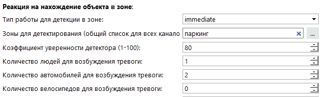

При данных настройках тревога будет вызвана моментально как только в зоне 'паркинг' будет детектировано 2 автомобиля
или 1 человек.

<h4>Вариант 2-b. Реакция при длительном превышении количества объектов в зоне.</h4>

В поле 'тип работы для детекции в зоне' необходимо выбрать long-lasting, задать время наблюдения перед тревогой и
задать долю удовлетворительных детекций, выбрать зоны для детекции, коэффициент уверенности и количество объектов
для возбуждения тревоги.

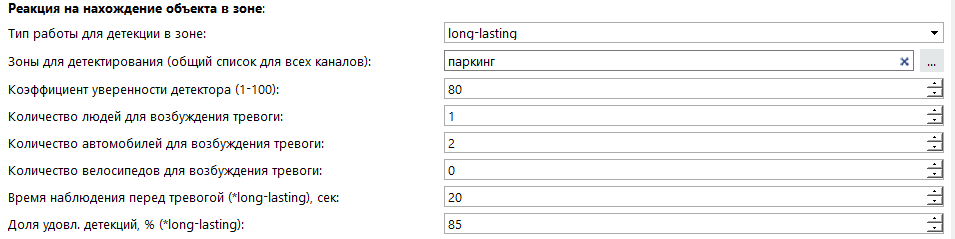 

Особенностью работы скрипта при использовании данного способа является то, что скрипт реагирует если в заданной зоне
на протяжении установленного времени детектируется заданное количество объектов.  Если в настройках нейронного
детектора на канале отмечен только подсчет объектов, то период  повторения  подсчета объектов должен быть в два
раза меньше времени наблюдения перед тревогой. Т.е. за период наблюдения должно происходить не менее двух детекций.  
Доля удовлетворительных детекций это отношение всех детекций за период приблизительно равный времени наблюдения к
количеству детекций в которых количество наблюдаемых объектов больше или равно заданному.

<h4>Настройка параметров скрипта на события пересечения границы нейродетектора.</h4>

 
    <ul>
      <li>Необходимо отметить чекбокс "Пересечение границы нейродетектора".
        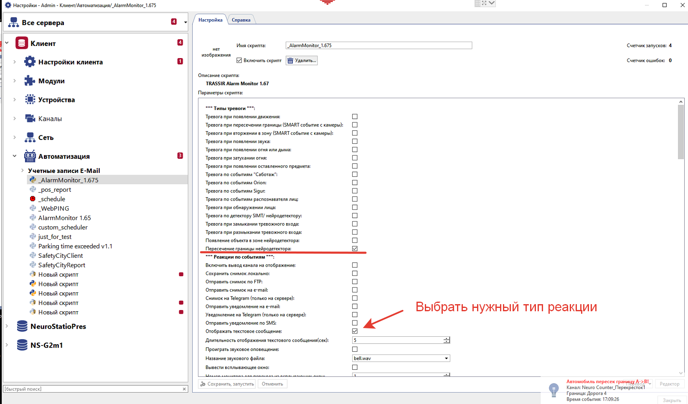  
      </li> 
      <li>Выполнить необходимые настройки в разделе "Настройки нейронного детектора":
        <ul>    
          <li>в разделе "Границы для реакции" указать имена границ   
            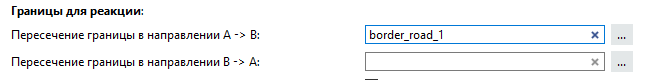      
          </li>
          <li>выбрать тип объекта для реакции   
            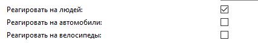
          </li>  
        </ul>  
      </li>    
      <li>На выбранных каналах в настройках нейронного детектора отмечаем чекбокс "Трассировать объекты"</li>    
      <li>Проверяем, что граница за которой наблюдаем находится внутри какой-либо зоны.</li>
    </ul>

<h3> Работа по событиям замыкания/ размыкания тревожного входа</h3>
<h4>Настройка параметров скрипта для работы по событиям замыкания/ размыкания тревожного входа</h4>

    Тревожный вход является самостоятельным объектом. В скрипте существует возможность "вручную"" привязать тревожный
    вход к любому доступному каналу после чего при замыкании тревожного входа скрипт будет интерпретировать событие так,
    будто оно пришло с привязанного канала. Т.о. можно выводить несколько каналов на тревожный экран при замыкании/размыкании
    входа каким-либо охранным датчиком. 
    Если выбрано несколько ассоциированных каналов, то при уведомлении на e-mail или Telegram будет отправлено такое же
    количество уведомлений при замыкании/размыкании одного тревожного входа.

<h3>Работа по событиям появления движения</h3>
<h4>Настройка параметров скрипта для работы по событиям</h4>

    Необходимо выбрать чекбокс "Тревога при появлении движения", указать нужные серверы и каналы. Так же необходимо убедиться, 
    что в настройках нужных каналов стоит галка "Генерировать события о появлении движения" и включен детектор движения. 
    Помните, что событие генерируется при появлении движения, повторно событие возникает на канале при изменении состояния
    с "нет движения" на "движение".

<h3>Реакции по событиям</h3>

<h4> Вывод канала на отображение</h4>

Данный тип реакции используется для отображения каналов на которых произошло нужное событие.

В разделе "Тревожный монитор" необходимо указать имя тревожного шаблона. Причем шаблон с таким именем должен быть предварительно создан. Раскладка данного шаблона не имеет значения, т.к. скрипт использует стандартные раскладки в зависимости от количества отображаемых каналов. Если необходимо, чтобы после того, как произошло отображение тревожных каналов скрипт переключался на какой-либо базовый шаблон, нужно указать имя данного шаблона в поле "Базовый шаблон".

При выборе типа действия "Открыть момент в архиве" после наступления события через \~5 сек открывается проигрывание архивного видео момента события. При такой настройке на тревожном мониторе может выводиться не более одного канала. Если в течение 5 секунд видео поток не успел записаться на жесткий диск, то проигрывание не начнётся.

Сброс тревоги только при отсутствии движения на канале - если выбрана данная настройка, то тревожный канал отображается до прекращения движения на нём.

Сброс тревоги при смене шаблона - при выборе данной настройки счетчик отображения тревожных каналов отключается если пользователь переключается на другой шаблон. При возникновении новых тревог, соответствующие тревожные каналы

<h4>Отправка уведомлений/ скриншотов на e-mail</h4>

Если необходимо отправить простое текстовое уведомление на электронную почту, то следует выбрать "Отправить уведомление на e-mail". Если необходимо такое уведомление с прикрепленным скриншотом, то необходимо выбрать "Отправить снимок на e-mail"

В разделе "Настройка e-mail" необходимо указать предварительно созданную учетную запись отправителя и получателей через запятую без пробелов.

<h4> Отправка снимков в Telegram</h4>

В разделе "Telegram" необходимо указатьTelegram ID всех пользователей, кому хотите предоставить доступ к серверу с помощью бота.
Для того, чтобы узнать id напишите боту @trassirbot команду /tbot и в ответ вы получите сообщение, где будет указан Ваш id:
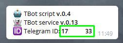

Данная функция может использоваться только на сервере. 

В разделе "Telegram" необходимо указать числовой id пользователя, который можно узнать с помощью Telegram бота @userinfobot:
<ul>
  <li>добавить в Telegram @userinfobot</li>
  <li>отправить /start</li>
</ul>

<h4>Отправка SMS</h4>
Для уведомления через SMS используется сервис SMSC.RU
Для использования данной функции необходимо предварительно зарегистрироваться и получить логин и пароль.

В разделе "Настройки SMS" необходимо указать номера в формате 79991112233, логин и пароль или MD5-хеш пароля.

<h4> Операции с тревожными выходами</h4>
Возможно выполнить замыкание, размыкание или последовательность этих действий с тревожными выходами. Тревожных выходов может быть заданно несколько.
Задержка перед последующей операцией с тревожным выходом это то время, которое проходит между двумя последовательными действиями. Например, если выбран тип работы замкнуть-разомкнуть и параметр задержки составляет 5 секунд, то при наступлении события тревожный выход замкнется и через 5 секунд разомкнётся.

<h4> Генерация тревоги (инцидента)</h4>
<a href="https://www.dssl.ru/files/trassir/manual/ru/cloud-incidents.html">Подробнее об инцидентах</a>
Необходимо указать токен инцидента в поле "Отправить тревогу по токену"
Если данное поле не пустое, то тревога (инцидент) будет сгенерирована.

