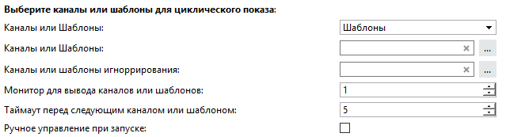
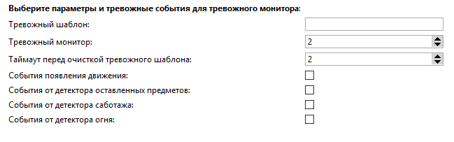

## Основные функции

Циклический просмотр выбранных каналов или всех с возможностью остановить цикл просмотра и выводом изображения на тревожный монитор по событиям.

Возможности:
* Циклический просмотр всех или части каналов или шаблонов.
* Задержка на канале или шаблоне при циклическом просмотре по горячим клавишам.
* При наличии второго монитора, можно вывести тревожный монитор по ряду событий.

## Установка

* Перейти в автоматизацию, нажать «Загрузить пример» и выбрать «Из файла», указав путь к скрипту.
* Снять галочку «Включить скрипт» и нажать сохранить.
* Выполнить настройку и нажать "Сохранить и запустить".

## Настройка скрипта

1. Выберите что будем отображать.
2. Выбрать каналы или шаблоны для показа. Если каналы или шаблоны не выбраны, будут показываться все активные каналы или шаблоны которые есть на сервере, или серверах, подключенных к клиенту.
3. Выбрать каналы или шаблоны игнорирования, в этом списке будут каналы или шаблоны, которые не будут отображаться.
4. Выбрать монитор, по умолчанию - 1.
5. Установить таймаут перед переключением на следующий канал или шаблон, в секундах.
6. Если вы хотите управлять переключением каналов или шаблонов вручную, по умолчанию(при запуске), установите флаг.

**Прим:** Если не выбран тревожный шаблон, отработки по событиям происходить не будет. Если был выбран список каналов ранее, то тревожный монитор будет работать только на них, если нет, значит на всех каналах.

1. Написать имя тревожного шаблона.
*Прим*.: Шаблон должен находиться на локальном сервере\клиенте, и его нужно создать, перед настройкой. [Как создать шаблон?](http://www.dssl.ru/files/trassir/manual/ru/operator-templates.html)
3. Выбрать монитор для отображения.
4. Таймаут (в секундах) перед постепенной очисткой шаблона (после первого таймаута удалится канал который пришел первым на шаблон и т.д).
5. Выбрать реакцию на события по которым будет сработка тревожного монитора.

## Работа со скриптом

**F1** - Запуск автоматического переключения каналов или шаблонов (запускается автоматом, если не установлен флаг "Ручное управление при запуске").
**F2** - Остановка Автоматического переключения, режим ручного управления.

Ручное управление:

* **F5** - Переключение канала или шаблона вперед по списку.
* **F6** - Переключение канала или шаблона назад по списку.