## **Основные функции**

Cкрипт предназначен для уведомления пользователей о продолжительных событиях, например, непрерывном движении в течении нескольких секунд.

##### Возможно активировать оповещение по следующим событиям:
| Тип события                          |      Скриншот      | Описание события                                             |
| :----------------------------------- | :----------------: | :----------------------------------------------------------- |
| **Signal Lost/Restored**             | :heavy_check_mark: | Потеря/восстановление сигнала                                |
| **Motion Start/Stop**                | :heavy_check_mark: | Обнаружено/прекращено движение                               |
| **Fire Detected/Stopped**            | :heavy_check_mark: | Обнаружен/прекратился огонь/дым                              |
| **Connection Lost/Established**      |        :x:         | Потеря/восстановление соединения с *устройством*             |
| **Disconnected From/Connected To**   |        :x:         | Отключение от/Подключение к *серверу*                        |
| **Object Entered/Left the Zone**     | :heavy_check_mark: | Вход/выход из зоны                                           |
| **Output Low to High/High to Low**   |        :x:         | Замыкание/размыкание тревожного выхода                       |
| **Input Low to High/High to Low**    |        :x:         | Замыкание/размыкание тревожного входа                        |
| **DP Objects Inside More/Less than** | :heavy_check_mark: | Превышение/Уменьшение количества объектов зоне (нейросетевой детектор) |

**Способы оповещения:**

Звуковое оповещение

<ul>
	<li>screenshots_folder/my_sound.wav</li>
	<li>SNES-startup.wav</li>
	<li>alarm.wav</li>
	<li>bell.wav</li>
	<li>boxing-bell-1.wav</li>
    <li>boxing-bell-3.wav</li>
    <li>cardlock-open.wav</li>
    <li>chime.wav</li>
    <li>chip001.wav</li>
    <li>chip019.wav</li>
    <li>chip069.wav</li>
    <li>cordless-phone-ring.wav</li>
    <li>countdown.wav</li>
    <li>dialtone.wav</li>
    <li>ding.wav</li>
    <li>horn-beep.wav</li>
    <li>phone-beep.wav</li>
    <li>police2.wav</li>
    <li>ship-on-fog.wav</li>
    <li>ships-bell.wav</li>
    <li>spin-up.wav</li>
    <li>tada1.wav</li>
    <li>tape-slow9.wav</li>
</ul>

Pop-up

    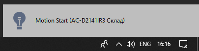
    

    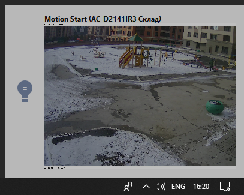

Pop-up with button

    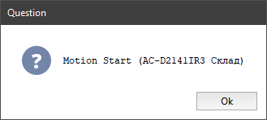
    

    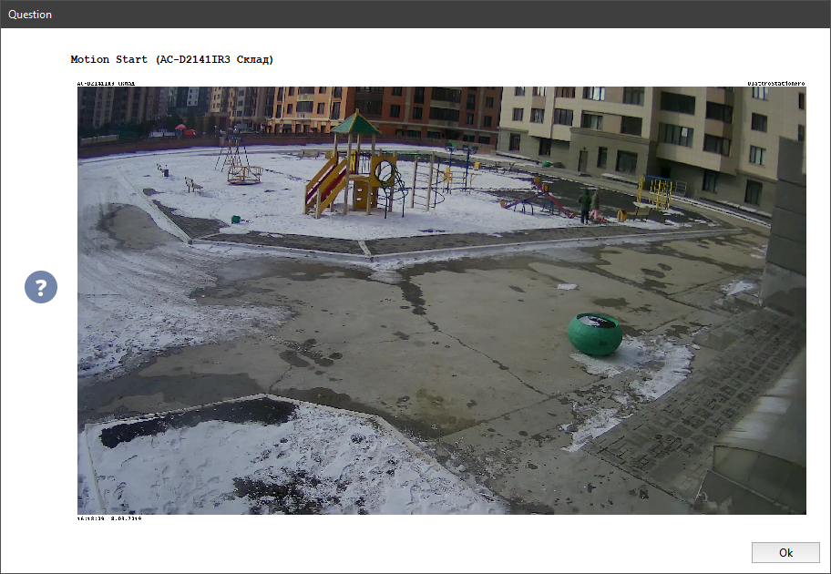

Telegram

    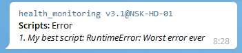

Push

    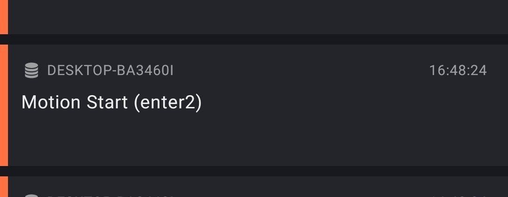
    

    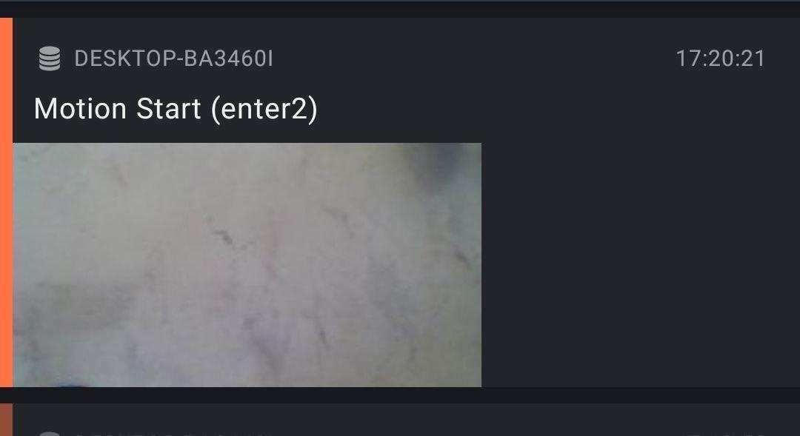

E-Mail

    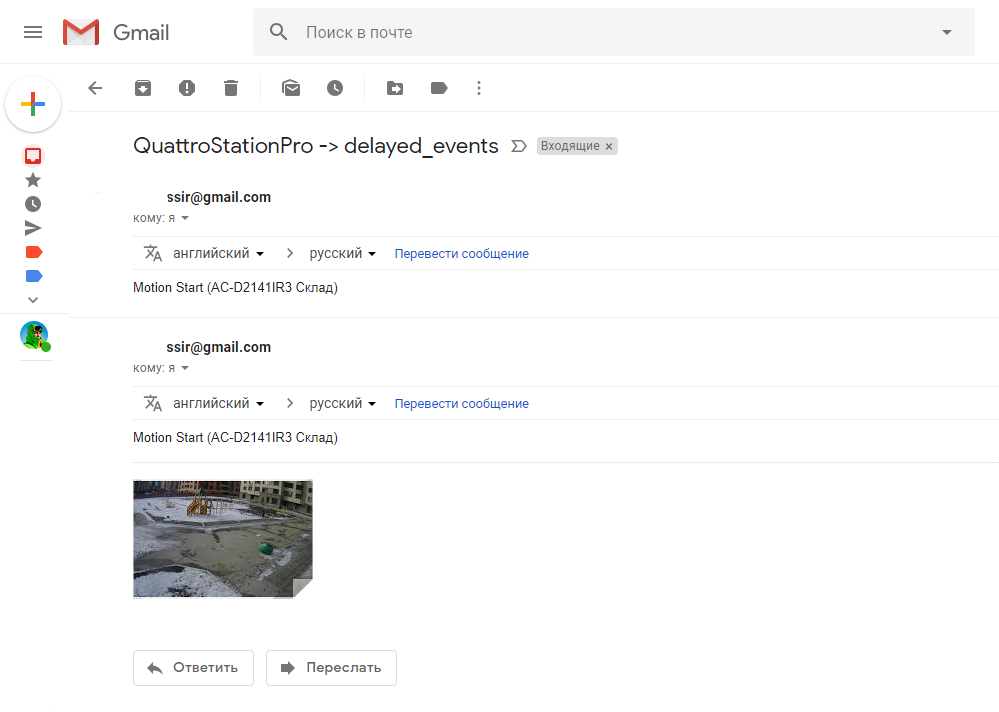

SMS

    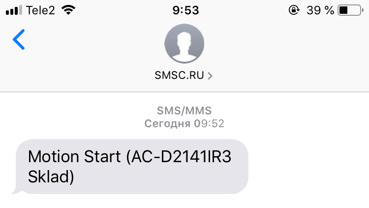

FTP

    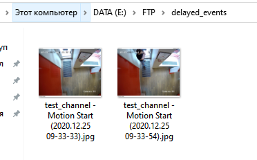

### Установка:
Скрипт необходимо добавить в разделе **Автоматизация** → **Новый скрипт** → **Загрузить пример** → **Из файла…**
После загрузки скрипта необходимо нажать на кнопку *«Сохранить, запустить»* и выполнить его настройку.

### Настройка:

Основные настройки

    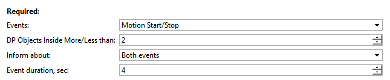
    <table>
<thead>
  <tr>
    <th>Параметр</th>
    <th>Возможные значения</th>
    <th>Описание</th>
  </tr>
</thead>
<tbody>
  <tr>
    <td>Events</td>
    <td>
      <ul>
        <li>Signal Lost/Restored, <strong>Каналы</strong></li>
        <li>Motion Start/Stop, <strong>Каналы</strong></li>
        <li>Fire Detected/Stopped, <strong>Каналы</strong></li>
        <li>Connection Lost/Established, <strong>IP Устройства</strong></li>
		<li>Disconnected From/Connected To,<strong>Сервера</strong></li>
        <li>Object Entered/Left the Zone, <strong>Зоны SIMT</strong></li>
        <li>Output Low to High/High to Low,<strong>Тревожные входы</strong></li>
        <li>DP Objects Inside More/Less than,<strong>Нейросетевой детектор людей</strong></li>
      </ul>
    </td>
    <td>Типы событий, с которыми будет работать скрипт.</td>
  </tr>
  <tr>
    <td>DP Objects Inside More/Less than</td>
    <td>1-50 человек</td>
    <td>Максимальное кол-во людей в зоне, превышение которого генерирует событие событие DP Objects Inside...</td>
  </tr>
  <tr>
    <td>Inform about</td>
    <td>
        <ul>
            <li>Both events, <strong>Оба события</strong></li>
            <li>First event, <strong>Только первое</strong></li>
            <li>Second event, <strong>Только второе</strong></li>
        </ul>
    </td>
    <td>Указывает скрипту о каких событиях отправлять уведомления.
        Например, <strong>Events = Signal Lost/Restored</strong>
		и <strong>Inform about = First event</strong>.
        Будут приходить уведомления только о событии <strong>Signal Lost</strong>.
      </td>
  </tr>
  <tr>
    <td>Event duration, sec</td>
    <td>1 - 999999 секунд</td>
    <td>Минимальная продолжительность события, после которого отправляется уведомление.
      Например, <strong>Event duration = 5</strong>
      Все события, длительностью <strong>менее 5 сек</strong>. будут игнорироваться.
    </td>
  </tr>
</tbody>
</table>

Дополнительные настройки

    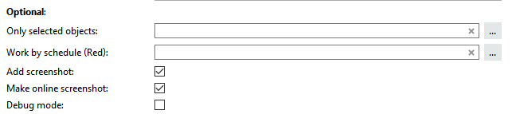
    <table>
<thead>
  <tr>
    <th>Параметр</th>
    <th>Возможные значения</th>
    <th>Описание</th>
  </tr>
</thead>
<tbody>
  <tr>
    <td>Only selected objects</td>
    <td>Список объектов через запятую, не обязательный параметр.
        Имена объектов должны быть <strong>уникальными</strong> и <strong>НЕ</strong> должны содержать в имени запятые!
    </td>
    <td>Указывает с какими объектами работать скрипту.
        Если не указано - работает со всеми доступными объектами.
    </td>
  </tr>
  <tr>
    <td>Work by schedule (Red)</td>
    <td>Имя предварительно созданного расписания, не обязательный параметр.
        <a href="https://www.dssl.ru/files/trassir/manual/ru/setup-schedule.html">Как создать расписание?</a>
     </td>
    <td>Скрипт будет отправлять уведомления только в (красной) зоне расписания, если оно выбрано.</td>
  </tr>
  <tr>
    <td>Add screenshot</td>
    <td>True/False</td>
    <td>
        <strong>True</strong> - добавляет скриншот к уведомлению
		<strong>False</strong> - отправляет только текстовое сообщение
    </td>
  </tr>
  <tr>
    <td>Make online screenshot</td>
    <td>True/False</td>
    <td>
        <strong>True</strong> - делает онлайн скриншот во время отправки уведомления
		<strong>False</strong> - делает скриншот из архива по времени создания события
    </td>
  </tr>
  <tr>
    <td>Debug mode</td>
    <td>True/False</td>
    <td>Режим отладки (сохраняет подробные логи)</td>
  </tr>
</tbody>
</table>

Простые уведомления

    
<table>
<thead>
  <tr>
    <th>Параметр</th>
    <th>Возможные значения</th>
    <th>Описание</th>
  </tr>
</thead>
<tbody>
  <tr>
    <td>Play sound</td>
    <td>True/False</td>
    <td><strong>True</strong> - активирует звуковое уведомление</td>
  </tr>
  <tr>
    <td>Sound file</td>
    <td>
        <ul>
            <li>screenshots_folder/my_sound.wav</li>
            <li>SNES-startup.wav</li>
            <li>alarm.wav</li>
            <li>bell.wav</li>
            <li>boxing-bell-1.wav</li>
            <li>boxing-bell-3.wav</li>
            <li>cardlock-open.wav</li>
            <li>chime.wav</li>
            <li>chip001.wav</li>
            <li>chip019.wav</li>
            <li>chip069.wav</li>
            <li>cordless-phone-ring.wav</li>
            <li>countdown.wav</li>
            <li>dialtone.wav</li>
            <li>ding.wav</li>
            <li>horn-beep.wav</li>
            <li>phone-beep.wav</li>
            <li>police2.wav</li>
            <li>ship-on-fog.wav</li>
            <li>ships-bell.wav</li>
            <li>spin-up.wav</li>
            <li>tada1.wav</li>
            <li>tape-slow9.wav</li>
        </ul>
    </td>
    <td>Файл для проигрывания.
        Можно добавить свой звуковой файл, для этого:
        <ol>
            <li>Переименуйте файл в <strong>my_sound.wav</strong></li>
            <li>Добавьте файл в папку скриншотов</li>
            <li>Выберите в параметрах скрипта <strong>screenshots_folder/my_sound.wav</strong></li>
        </ol>
        Файл должен быть в формате wav
    </td>
  </tr>
  <tr>
    <td>Pop-up</td>
    <td>True/False</td>
    <td><strong>True</strong> - активирует уведомление в правом нижнем углу</td>
  </tr>
  <tr>
    <td>Image width, px</td>
    <td>100-4320 px</td>
    <td>Ширина изображения во всплывающем окне,высота изменяется пропорционально оригинальному изображению</td>
  </tr>
  <tr>
    <td>Pop-up with button</td>
    <td>True/False</td>
    <td><strong>True</strong> - активирует уведомление в окне, которое закрывается кнопкой "Ok".
        Уведомление автоматически закрывается через 60 секунд
    </td>
  </tr>
  <tr>
    <td>Image width, px</td>
    <td>100-4320 px</td>
    <td>Ширина изображения во всплывающем окне
		Высота изменяется пропорционально оригинальному изображению
    </td>
  </tr>
</tbody>
</table>

Telegram

    Уведомления отправляются через телеграмм бота <a href="http://t.me/trassirbot">@trassirbot</a>
     
     
    Для отправки уведомлений через Telegram скрипт обязательно должен быть запущен на <strong>сервере Trassir</strong>,
	на клиенте Trassir скрипт вызовет ошибку ERROR: ServerKeyError: Server key is not available
<table>
    <thead>
      <tr>
        <th>Параметр</th>
        <th>Возможные значения</th>
        <th>Описание</th>
      </tr>
    </thead>
    <tbody>
      <tr>
        <td>Enable</td>
        <td>True/False</td>
        <td><strong>True</strong> - активирует отправку уведомлений через бота <a href="http://t.me/trassirbot">@trassirbot</a>			</td>
      </tr>
      <tr>
        <td>Telegram id's</td>
        <td>Уникальный Telegram id получателя, можно указать несколько id через запятую</td>
        <td>Список id получателей уведомлений.
            Напишите боту @trassirbot команду /tbot в ответ вы получите сообщение, где будет указан Ваш id
             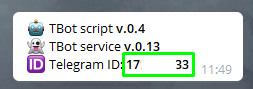
             Если указать id не верный - скрипт вызовет ошибку Chat not found
            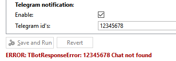
        </td>
      </tr>
    </tbody>
</table>

Push

    Push уведомления
     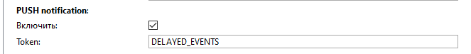
     Для отправки уведомлений в Trassir Cloud необходимо создать инцидент и указать его в поле Token. <a 	           href="https://www.dssl.ru/files/trassir/manual/ru/cloud-incidents.html">Подробнее о создании инцидентов.</a>
    <table>
        <thead>
          <tr>
            <th>Параметр</th>
            <th>Возможные значения</th>
            <th>Описание</th>
          </tr>
        </thead>
        <tbody>
          <tr>
            <td>Enable</td>
            <td>True/False</td>
            <td><strong>True</strong> - активирует отправку уведомлений через бота <a href="http://t.me/trassirbot">@trassirbot</a></td>
          </tr>
          <tr>
            <td>Token</td>
            <td>Уникальный Token инцидента</td>
            <td>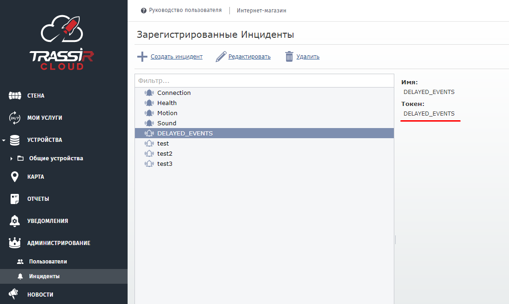</td>
          </tr>
        </tbody>
    </table>

Почтовые уведомления

    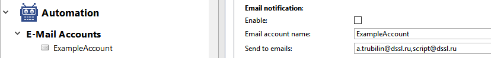
    <table>
        <thead>
          <tr>
            <th>Параметр</th>
            <th>Возможные значения</th>
            <th>Описание</th>
          </tr>
        </thead>
        <tbody>
          <tr>
            <td>Enable</td>
            <td>True/False</td>
            <td><strong>True</strong> - активирует отправку уведомлений на электронную почту</td>
          </tr>
          <tr>
            <td>Email account name</td>
            <td>Имя E-Mail Аккаунта</td>
            <td>Необходимо указать имя предварительно созданного аккаунта E-Mail
                <a href="https://www.dssl.ru/files/trassir/manual/ru/setup-email-account.html">Добавление учетной записи</a>
                Имя аккаунта чувствительно к регистру, если допущена ошибка в имени аккаунта - скрипт вызовет ошибку Can't find account
                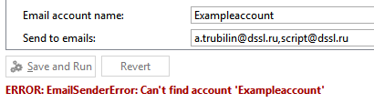
            </td>
          </tr>
          <tr>
            <td>Send to emails</td>
            <td>E-Mail получателя. Возможно указать несколько получателей через запятую</td>
            <td>Список адресов для отправки уведомлений
                Если указать не правильный E-Mail - скрипт вызовет ошибку E-mail is not valid
                 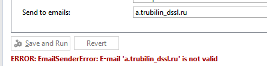
            </td>
          </tr>
        </tbody>
    </table>

SMS уведомления

    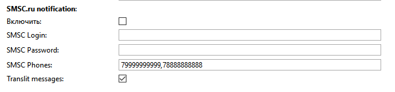
     Отправка смс сообщения осуществляется с помощью сервиса <a href="https://smsc.ru/">smsc.ru</a>
    

        По умолчанию сервис smsc.ru отправляет сообщения от своего имени SMSC.RU.
		При этом отправка на номера Мегафон/Yota недоступна т.к. имя SMSC.RU заблокировано оператором.
         Мы настоятельно <strong>НЕ</strong> рекомендуем использовать стандартное имя SMSC.RU.
         Для отправки смс от вашего буквенного имени необходимо его создать в разделе - <a href="https://smsc.ru/senders/">https://smsc.ru/senders/</a> и зарегистрировать для операторов в
        колонке Действия по кнопке Изменить (после заключения договора согласно инструкции - <a href="https://smsc.ru/contract/info/">https://smsc.ru/contract/info/</a> ) а также приложить гарантийное письмо на МТС в личный кабинет <a href="http://smsc.ru/documents/">http://smsc.ru/documents/</a> и отправить на почту <a href="inna@smsc.ru">inna@smsc.ru</a>
    

    <table>
        <thead>
          <tr>
            <th>Параметр</th>
            <th>Возможные значения</th>
            <th>Описание</th>
          </tr>
        </thead>
        <tbody>
          <tr>
            <td>Enable</td>
            <td>True/False</td>
            <td><strong>True</strong> - активирует отправку уведомлений по смс</td>
          </tr>
          <tr>
            <td>SMSC Login</td>
            <td>Логин</td>
            <td>Логин пользователя</td>
          </tr>
          <tr>
            <td>SMSC Password</td>
            <td>Пароль</td>
            <td>Пароль пользователя</td>
          </tr>
          <tr>
            <td>SPSC Phones</td>
            <td>Номера телефонов, возможно указать несколько телефонных номеров через запятую или точку с запятой</td>
            <td>Номер или разделенный запятой или точкой с запятой список номеров мобильных телефонов в международном формате,
                на которые отправляется сообщение.
            </td>
          </tr>
          <tr>
            <td>Translin messages</td>
            <td>True/False</td>
            <td>Если активно - переводит сообщение в транслит</td>
          </tr>
        </tbody>
    </table>

Замыкание тревожного выхода

    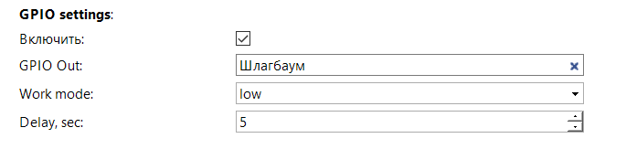
    <table>
        <thead>
          <tr>
            <th>Параметр</th>
            <th>Возможные значения</th>
            <th>Описание</th>
          </tr>
        </thead>
        <tbody>
          <tr>
            <td>Enable</td>
            <td>True/False</td>
            <td><strong>True</strong> - активирует замыкание тревожного выхода</td>
          </tr>
          <tr>
            <td>GPIO Out</td>
            <td>Тревожный выход</td>
            <td>Логин пользователя</td>
          </tr>
          <tr>
            <td>Work mode</td>
            <td>
                <ul>
                    <li>high - замкнуть</li>
                    <li>high-low -  замкнуть, разомкнуть</li>
                    <li>low - разомкнуть</li>
                    <li>low-high - разомкнуть, замкнуть</li>
                </ul>
            </td>
            <td>Режим работы тревожного выхода</td>
          </tr>
          <tr>
            <td>Delay, sec</td>
            <td>Секунд</td>
            <td>Время между действиям (только для режимов high-low/low-high)</td>
          </tr>
        </tbody>
    </table>

Отправка скриншотов на FTP

    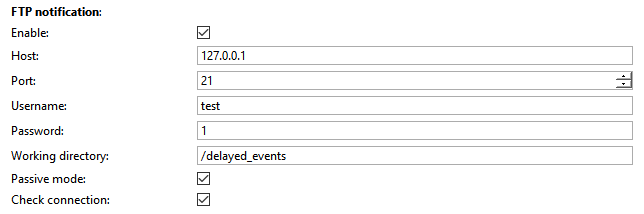
    <table>
        <thead>
          <tr>
            <th>Параметр</th>
            <th>Возможные значения</th>
            <th>Описание</th>
          </tr>
        </thead>
        <tbody>
          <tr>
            <td>Enable</td>
            <td>True/False</td>
            <td><strong>True</strong> - активирует отправку скриншота на FTP</td>
          </tr>
          <tr>
            <td>Host</td>
            <td>IP адрес</td>
            <td>IP адрес FTP сервера</td>
          </tr>
          <tr>
            <td>Port</td>
            <td>Порт</td>
            <td>Порт для подключения к FTP</td>
          </tr>
          <tr>
            <td>Username</td>
            <td>Пользователь</td>
            <td>Имя пользователя для подключения к FTP</td>
          </tr>
          <tr>
            <td>Password</td>
            <td>Пароль</td>
            <td>Пароль пользователя для подключения к FTP</td>
          </tr>
          <tr>
            <td>Working directory</td>
            <td>Рабочая папка на FTP</td>
            <td>Папка в которую будут сохраняться скриншоты, в случае если ее не существует - то она будет создана</td>
          </tr>
          <tr>
            <td>Passive mode</td>
            <td>True/False</td>
            <td><strong>True</strong> - активирует пассивный режим работы FTP</td>
          </tr>
          <tr>
            <td>Check connection</td>
            <td>True/False</td>
            <td><strong>True</strong> - активирует проверку соединения с FTP при старте скрипта</td>
          </tr>
        </tbody>
    </table>

