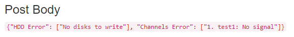
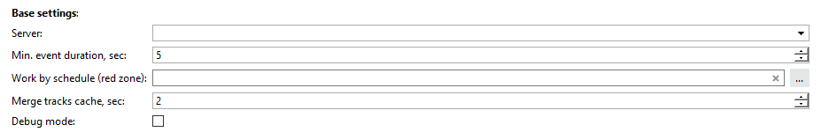

## Основные функции
Данный скрипт предназначен для оповещения об изменениях состояния здоровья сервера.

**Способы оповещения**

Звуковое оповещение

<ul>
    <li>screenshots_folder/my_sound.wav</li>
    <li>SNES-startup.wav</li>
    <li>alarm.wav</li>
    <li>bell.wav</li>
    <li>boxing-bell-1.wav</li>
    <li>boxing-bell-3.wav</li>
    <li>cardlock-open.wav</li>
    <li>chime.wav</li>
    <li>chip001.wav</li>
    <li>chip019.wav</li>
    <li>chip069.wav</li>
    <li>cordless-phone-ring.wav</li>
    <li>countdown.wav</li>
    <li>dialtone.wav</li>
    <li>ding.wav</li>
    <li>horn-beep.wav</li>
    <li>phone-beep.wav</li>
    <li>police2.wav</li>
    <li>ship-on-fog.wav</li>
    <li>ships-bell.wav</li>
    <li>spin-up.wav</li>
    <li>tada1.wav</li>
    <li>tape-slow9.wav</li>
</ul>

Pop-up

    

Pop-up with button

    

Generate event

	Создает события, которые можно "отлавливать" с помощью других скриптов
      

Telegram @trassirbot

     

E-Mail

     

SMS

     

POST запрос

     

## Установка

Начиная с версии 3.3 добавлена возможность запуска скрипта на клиенте.

* Перейти в автоматизацию, нажать «Загрузить пример» и выбрать «Из файла», указав путь к скрипту.
* Снять галочку «Включить скрипт» и нажать сохранить.
* Выполнить настройку и нажать "Сохранить и запустить".

## Настройка

Основные настройки

     
    <table>
        <thead>
          <tr>
            <th>Параметр</th>
            <th>Возможные значения</th>
            <th>Описание</th>
          </tr>
        </thead>
        <tbody>
          <tr>
            <td>Server</td>
            <td>Сервер в сети, обязательный параметр</td>
            <td>Сервер для отслеживания состояния здоровья.</td>
          </tr>
          <tr>
            <td>Min. event duration, sec</td>
            <td>0 - 100000 секунд</td>
            <td>Минимальная продолжительность события</td>
          </tr>
          <tr>
            <td>Work by schedule (red zone)</td>
            <td>Имя предварительно созданного расписания. Не обязательный параметр.
                 <a href="https://www.dssl.ru/files/trassir/manual/ru/setup-schedule.html">Как создать расписание?</a>
            </td>
            <td>Если указано расписание - скрипт будет отправлять уведомления только, когда находится в красной зоне расписания
            </td>
          </tr>
          <tr>
            <td>Merge tracks cache, sec</td>
            <td>0 - 10 секунд</td>
            <td>Позволяет объединять несколько сообщений в одно.
                 Увеличивает время отправки сообщений на указанный интервал
            </td>
          </tr>
          <tr>
            <td>Debug mode</td>
            <td>True/False</td>
            <td>Режим отладки (сохраняет подробные логи)</td>
          </tr>
        </tbody>
    </table>

Типы событий

	 
	<table>
        <thead>
          <tr>
            <th>Параметр</th>
            <th>Возможные значения</th>
            <th>Описание</th>
          </tr>
        </thead>
        <tbody>
          <tr>
            <td>CPU load > 90%</td>
            <td>True/False</td>
            <td>Отслеживать превышение нагрузки на ЦПУ</td>
          </tr>
          <tr>
            <td>Cloud</td>
            <td>True/False</td>
            <td>Отслеживать состояние облака</td>
          </tr>
          <tr>
            <td>Disks</td>
            <td>True/False</td>
            <td>Отслеживать состояние дисков</td>
          </tr>
          <tr>
            <td>Count disks to write</td>
            <td>True/False</td>
            <td>Отслеживать количество дисков на запись</td>
          </tr>
          <tr>
            <td>Database</td>
            <td>True/False</td>
            <td>Отслеживать состояние базы данных</td>
          </tr>
          <tr>
            <td>IP Devices</td>
            <td>True/False</td>
            <td>Отслеживать состояние устройств</td>
          </tr>
          <tr>
            <td>Channels</td>
            <td>True/False</td>
            <td>Отслеживать состояние каналов</td>
          </tr>
          <tr>
            <td>Network</td>
            <td>True/False</td>
            <td>Отслеживать состояние сети</td>
          </tr>
          <tr>
            <td>Scripts</td>
            <td>True/False</td>
            <td>Отслеживать состояние скриптов</td>
          </tr>
        </tbody>
	</table>

Простые уведомления

    
    <table>
        <thead>
          <tr>
            <th>Параметр</th>
            <th>Возможные значения</th>
            <th>Описание</th>
          </tr>
        </thead>
        <tbody>
          <tr>
            <td>Play sound</td>
            <td>
                <ul>
                    <li>shots/alarm.wav</li>
                    <li>SNES-startup.wav</li>
                    <li>alarm.wav</li>
                    <li>bell.wav</li>
                    <li>boxing-bell-1.wav</li>
                    <li>boxing-bell-3.wav</li>
                    <li>cardlock-open.wav</li>
                    <li>chime.wav</li>
                    <li>chip001.wav</li>
                    <li>chip019.wav</li>
                    <li>chip069.wav</li>
                    <li>cordless-phone-ring.wav</li>
                    <li>countdown.wav</li>
                    <li>dialtone.wav</li>
                    <li>ding.wav</li>
                    <li>horn-beep.wav</li>
                    <li>phone-beep.wav</li>
                    <li>police2.wav</li>
                    <li>ship-on-fog.wav</li>
                    <li>ships-bell.wav</li>
                    <li>spin-up.wav</li>
                    <li>tada1.wav</li>
                    <li>tape-slow9.wav</li>
                </ul>
            </td>
            <td>Любое <strong>непустое</strong> значение активирует звуковое оповещение
                 Можно добавить свой звуковой файл, для этого:
					<ol>
                        <li>Переименуйте файл в <strong>alarm.wav</strong></li>
                        <li>Добавьте файл в папку скриншотов</li>
                        <li>Выберите в параметрах скрипта <strong>shots/my_sound.wav</strong></li>
                	</ol>
                 Файл должен быть в формате <strong>wav</strong>
            </td>
          </tr>
          <tr>
            <td>Pop-up</td>
            <td>True/False</td>
            <td><strong>True</strong> - активирует уведомление в правом нижнем углу</td>
          </tr>
          <tr>
            <td>Pop-up with button</td>
            <td>True/False</td>
            <td><strong>True</strong> - активирует уведомление в окне, которое закрывается кнопкой "Ok".
                 Уведомление автоматически закрывается через 60 секунд.
            </td>
          </tr>
          <tr>
            <td>Generate event</td>
            <td>True/False</td>
            <td><strong>True</strong> - активирует создание событий для обработки другими скриптами.</td>
          </tr>
        </tbody>
    </table>

Telegram

    
     Отправка уведомлений в телеграмм доступна только в случае установки скрипта на <strong>сервер</strong>.
    <table>
        <thead>
          <tr>
            <th>Параметр</th>
            <th>Возможные значения</th>
            <th>Описание</th>
          </tr>
        </thead>
        <tbody>
          <tr>
            <td>Enable</td>
            <td>True/False</td>
            <td><strong>True</strong> - активирует отправку уведомлений через бота <a href="http://t.me/trassirbot">@trassirbot</a>
            </td>
          </tr>
          <tr>
            <td>Telegram id's</td>
            <td>Уникальный Telegram id получателя
            	 Можно указать несколько id через запятую
            </td>
            <td>Напишите боту <a href="http://t.me/trassirbot">@trassirbot</a> команду /tbot
            	 В ответ вы получите сообщение, где будет указан Ваш id
            	
            </td>
          </tr>
        </tbody>
    </table>

Почтовые уведомления

    
    <table>
        <thead>
          <tr>
            <th>Параметр</th>
            <th>Возможные значения</th>
            <th>Описание</th>
          </tr>
        </thead>
        <tbody>
          <tr>
            <td>Enable</td>
            <td>True/False</td>
            <td><strong>True</strong> - активирует отправку уведомлений на электронную почту</td>
          </tr>
          <tr>
            <td>Add date to Email</td>
            <td>True/False</td>
            <td><strong>True</strong> - добавляет дату и время формирования события в тело письма</td>
          </tr>
          <tr>
            <td>Email account name</td>
            <td>Имя E-Mail Аккаунта</td>
            <td>Необходимо указать имя предварительно созданного аккаунта E-Mail
             <a href="https://www.dssl.ru/files/trassir/manual/ru/setup-email-account.html">Добавление учетной записи</a>
             Имя аккаунта чувствительно к регистру
             Если допущена ошибка в имени аккаунта - скрипт вызовет ошибку <strong>Can't find account</strong>
            
            </td>
          </tr>
          <tr>
            <td>Send to emails</td>
            <td>E-Mail получателя. Можно указать несколько получателей через запятую
            </td>
            <td>Список адресов для отправки уведомлений.
                 Если указать не правильный E-Mail - скрипт вызовет ошибку <strong>E-mail is not valid</strong>
                
            </td>
          </tr>
        </tbody>
    </table>

SMS уведомления

    
     Отправка смс сообщения осуществляется с помощью сервиса <a href="https://smsc.ru/">smsc.ru</a>
    

        По умолчанию сервис smsc.ru отправляет сообщения от своего имени SMSC.RU.
		При этом отправка на номера Мегафон/Yota недоступна т.к. имя SMSC.RU заблокировано оператором.
         Мы настоятельно <strong>НЕ</strong> рекомендуем использовать стандартное имя SMSC.RU.
         Для отправки смс от вашего буквенного имени необходимо его создать в разделе - <a href="https://smsc.ru/senders/">https://smsc.ru/senders/</a> и зарегистрировать для операторов в
        колонке Действия по кнопке Изменить (после заключения договора согласно инструкции - <a href="https://smsc.ru/contract/info/">https://smsc.ru/contract/info/</a> ) а также приложить гарантийное письмо на МТС в личный кабинет <a href="http://smsc.ru/documents/">http://smsc.ru/documents/</a> и отправить на почту <a href="inna@smsc.ru">inna@smsc.ru</a>
    

    <table>
        <thead>
          <tr>
            <th>Параметр</th>
            <th>Возможные значения</th>
            <th>Описание</th>
          </tr>
        </thead>
        <tbody>
          <tr>
            <td>Enable</td>
            <td>True/False</td>
            <td><strong>True</strong> - активирует отправку уведомлений по смс</td>
          </tr>
          <tr>
            <td>SMSC Login</td>
            <td>Логин</td>
            <td>Логин пользователя</td>
          </tr>
          <tr>
            <td>SMSC Password</td>
            <td>Пароль</td>
            <td>Пароль пользователя</td>
          </tr>
          <tr>
            <td>SPSC Phones</td>
            <td>Номера телефонов, возможно указать несколько телефонных номеров через запятую или точку с запятой</td>
            <td>Номер или разделенный запятой или точкой с запятой список номеров мобильных телефонов в международном формате,
                на которые отправляется сообщение.
            </td>
          </tr>
          <tr>
            <td>Translin messages</td>
            <td>True/False</td>
            <td>Если активно - переводит сообщение в транслит</td>
          </tr>
        </tbody>
    </table>

POST запрос

    
    <table>
        <thead>
          <tr>
            <th>Параметр</th>
            <th>Возможные значения</th>
            <th>Описание</th>
          </tr>
        </thead>
        <tbody>
          <tr>
            <td>Enable</td>
            <td>True/False</td>
            <td><strong>True</strong> - активирует отправку POST запроса</td>
          </tr>
          <tr>
            <td>Url</td>
            <td>Абсолютный url адрес</td>
            <td>Url адрес для отправки POST запроса</td>
          </tr>
        </tbody>
    </table>

