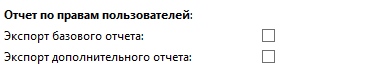
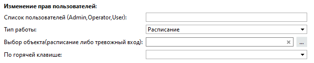
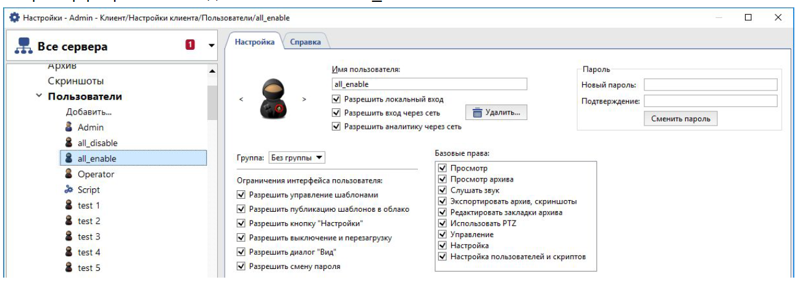
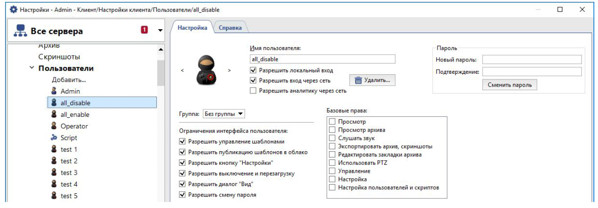
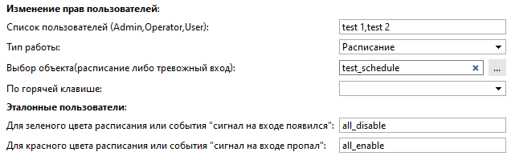

## Основные функции
Скрипт позволяет формировать отчеты по правам пользователей Trassir и изменять права выбранных пользователей.

## Возможности:
* Экспорт отчета базовых прав всех пользователей (users_base_rights.csv)
* Экспорт отчета дополнительных прав всех пользователей (users_acl_rights.csv)
* Изменение прав пользователя по расписанию
* Изменение прав пользователя по сигналу от тревожного входа
* Изменение прав пользователя при нажатии на горячую клавишу

## Установка
* Добавить скрипт в разделе Автоматизация->Новый скрипт->Загрузить пример->Из файла.
* После загрузки скрипта необходимо нажать на кнопку «Сохранить, запустить».
* Выключить скрипт, сняв чек-бокс и выполнить его настройку.

## Настройка скрипта

Для экспорта отчетов необходимо отметить галочкой соответствующее поле, “Сохранить и
запустить” скрипт. После чего в папке скриншотов появятся необходимые отчеты

**Список пользователей(Admin, Operator, User) -** список пользователей через запятую. Имена пользователей задаются с учетом регистра.

**Тип работы:**

- Расписание 
- Тревожный вход

:white_check_mark: [Как создать расписание?](https://www.dssl.ru/files/trassir/manual/ru/setup-schedule.html)

**Выбор объекта(расписание либо тревожный вход) -** выбор объекта для работы, в зависимости от того, было выбрано в пункте "Тип работы".

**По горячей клавише -** выбор клавиши для активации

Необходимо создать (выбрать) двух эталонных пользователей и настроить им соответствующие права доступа.

Например разрешить все для пользователя all_enable

## Пример использования

При переходе расписания в красную зону (либо события "сигнал на входе пропал") - права пользователей test 1, test 2 будут полностью повторять права доступа пользователя all_enable, а при переходе в зеленую зону (либо события "сигнал на входе появился") - права доступа пользователя all_disable.