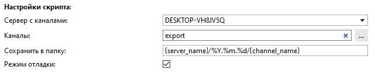
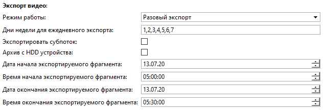
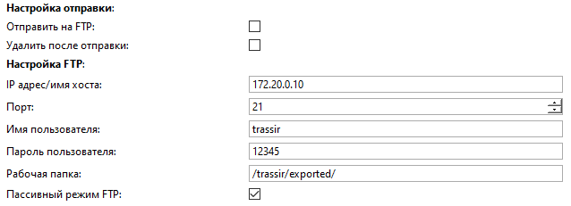

## Основные функции
Скрипт предназначен для автоматизированного экспорта видеофрагментов

## Возможности скрипта

<ul>
    <li>Экспорт видео:
        <ul>
            <li>разовый;</li>
            <li>ежедневный;</li>
        </ul>
    </li>
    <li><strong>Выбор каналов</strong> для экспорта;</li>
    <li><strong>Выбор пути сохранения</strong> скриншотов с учетом имени канала, имени сервера, даты и времени;</li>
    <li>Отправка видео:
    	<ul>
            <li>на FTP сервер</li>
        </ul>
    </li>
</ul> 

Основные настройки

    
    <table>
        <thead>
          <tr>
            <th>Параметр</th>
            <th>Описание</th>
          </tr>
        </thead>
        <tbody>
          <tr>
            <td>Сервер с каналами</td>
            <td>Выбор сервера для экспорта</td>
          </tr>
          <tr>
            <td>Каналы</td>
            <td>Список каналов через запятую.
                 Если указать неверное имя канала, то скрипт выдаст ошибку ObjectsNotFoundError: Не найдены объекты 
            </td>
          </tr>
          <tr>
            <td>Сохранить в папку</td>
            <td>Путь экспорта относительно папки скриншотов. По умолчанию: {server_name}/%Y.%m.%d/{channel_name}
                При указании пути сохранения доступны следующие переменные:
                <ul>
                    <li>{server_name} - Имя сервера с камерой;</li>
                    <li>{channel_name} - Имя канала;</li>
                    <li>%Y.%m.%d - Дата и время</li>
                </ul>
                Если Вам необходимо изменить стандартный путь для папки скриншотов на TrassirOS воспользуйтесь скриптом <a href="#">Change screenshots folder</a>
            </td>
          </tr>
          <tr>
            <td>Режим отладки</td>
            <td><strong>True</strong> - Активирует запись подробных логов</td>
          </tr>
        </tbody>
    </table>

Экспорт видео

    
    <table>
        <thead>
          <tr>
            <th>Параметр</th>
            <th>Описание</th>
          </tr>
        </thead>
        <tbody>
          <tr>
            <td>Режим работы</td>
            <td>Разовый или ежедневный экспорт</td>
          </tr>
          <tr>
            <td>Дни недели для ежедневного экспорта</td>
            <td>Дни недели, указываются через запятую</td>
          </tr>
          <tr>
            <td>Экспортировать субпоток</td>
            <td><strong>True</strong> - Экспортирует субпоток</td>
          </tr>
          <tr>
            <td>Архив с HDD устройства</td>
            <td><strong>True</strong> - Экспортирует архив с внутренней памяти устройства</td>
          </tr>
          <tr>
            <td>Дата начала экспортируемого фрагмента</td>
            <td>Задает дату для экспорта видео, для ежедневного экспорта дата не учитывается
            </td>
          </tr>
          <tr>
            <td>Время начала экспортируемого фрагмента</td>
            <td>Задает время начала экспорта видео</td>
          </tr>
          <tr>
            <td>Дата окончания экспортируемого фрагмента</td>
            <td>Задает дату окончания экспорта видео</td>
          </tr>
          <tr>
            <td>Время окончания экспортируемого фрагмента</td>
            <td>Задает время окончания экспорта видео</td>
          </tr>
        </tbody>
    </table>

Настройки отправки

    
    <table>
        <thead>
          <tr>
            <th>Параметр </th>
            <th>Описание</th>
          </tr>
        </thead>
        <tbody>
          <tr>
            <td>Отправить на FTP</td>
            <td>Активирует отправку скриншотов на ftp сервер</td>
          </tr>
          <tr>
            <td>Удалить после отправки</td>
            <td>Удаляет локальный файл скриншотов после отправки</td>
          </tr>
          <tr>
            <td colspan="2"><strong>Настройка FTP</strong></td>
          </tr>
          <tr>
            <td>IP адрес/имя хоста</td>
            <td>Адрес ftp сервера</td>
          </tr>
          <tr>
            <td>Порт</td>
            <td>Порт ftp сервера, по умолчанию 21</td>
          </tr>
          <tr>
            <td>Имя пользователя</td>
            <td>Имя пользователя ftp сервера</td>
          </tr>
          <tr>
            <td>Пароль пользователя</td>
            <td>Пароль пользователя ftp сервера</td>
          </tr>
          <tr>
            <td>Рабочая папка</td>
            <td>root папка на ftp сервере</td>
          </tr>
          <tr>
            <td>Пассивный режим FTP</td>
            <td>Активация пассивного режима работы FTP</td>
          </tr>
        </tbody>
    </table>

